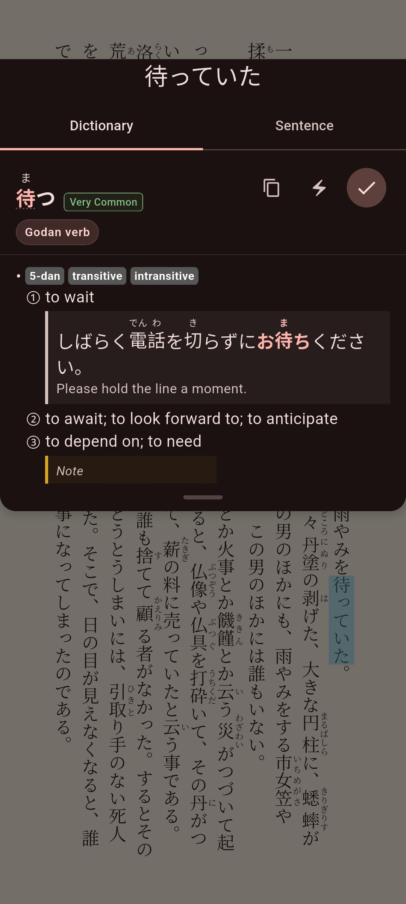

# Looking Up Words

Tap a word while you read to see what it means, or search your dictionaries in the app's **Dictionary** tab.

## Before you start

You need at least one dictionary. The quickest start is the starter pack. Tap **Get Dictionaries** on the empty library screen, or **Recommended starter pack** in the **Dictionary** tab. See [Setting Up Dictionaries](../getting-started/dictionaries.md).

## Look up a word while reading

1. Tap a word in the book. The lookup sheet opens, and the word is marked in the text.
2. To close the sheet, tap outside it.

The sheet opens at the bottom of the screen. If the word is in the lower half of the screen, the sheet opens at the top, so it does not cover the word.

The same sheet opens in the manga reader. There you tap text found by mokuro (a tool that adds OCR text to manga) or by on-device OCR. See [Reading Manga](../manga/cbz-reading.md) and [On-device OCR](../manga/on-device-ocr.md).

## What the lookup sheet shows

The sheet lists every word that matches. For each word you see:

- The word and its reading, with furigana (small kana) over the kanji.
- A frequency badge: **Very Common** (among the 5,000 most used words), **Common** (top 15,000), **Uncommon** (top 30,000) or **Rare**. It comes from a word frequency dictionary, such as the JPDB list in the starter pack. A word that no frequency dictionary lists has no badge.
- Part of speech tags, such as **Noun**, **Godan verb** or **Na-adjective**.
- Pitch accent diagrams, if you imported a dictionary with pitch accent data. Pitch accent is the pattern of high and low pitch in a word. Mekuru does not download a pitch accent dictionary for you, so import a Yomitan one yourself. See [Import a Yomitan dictionary](../getting-started/dictionaries.md#import-a-yomitan-dictionary).
- Definitions, grouped by dictionary. Each group is labeled with the dictionary's name. The groups follow your order in the Dictionary Manager.

Yomitan dictionaries (a common dictionary format) can bring their own layout. Jitendex, for example, shows example sentences. Dictionaries that include images show them too.

A kanji entry from KANJIDIC shows the kanji's Onyomi and Kunyomi readings.

When a word has long definitions, its header (the word, badge and buttons) stays at the top while you scroll.

To look up something you see in the sheet, tap a kanji in the word, or a Japanese word in a definition. Mekuru opens a dictionary search for it.

To change the text size in the sheet, use **Lookup Font Size** in the reader's Quick Settings, or go to **You › Settings › Lookup Font Size**.

## Conjugated words and compound words

Japanese has no spaces between words, so Mekuru works out where the word you tapped starts and ends.

- Conjugated words: tap 食べました and Mekuru looks up 食べる, the dictionary form.
- Compound words and set phrases: Mekuru checks whether the word you tapped is part of a longer entry in your dictionaries. If it is, the longest match comes first.

Only dictionaries that are turned on count.

## Switch between the Dictionary and Sentence tabs

When Mekuru knows the sentence around the word, the lookup sheet has two tabs:

- **Dictionary** shows the definitions.
- **Sentence** shows the whole sentence, with your word marked, and a translation. See [Sentence Translation](sentence-translation.md).

If **You › Settings › Sentence translation** is **Off**, the sheet shows only the definitions.

## Copy, save or send a word

Each word has these buttons:

- **Copy** copies the word.
- **Send to AnkiDroid** (lightning icon) makes an Anki card. The first time, it opens the Anki settings. A check mark means the word is already in your default deck. Press and hold the check mark to add the word again. See [Exporting to Anki](../vocabulary/anki-export.md).
- **Save to Vocabulary** saves the word, with the sentence you found it in, to the **Vocabulary** tab. A check mark means the word is already saved. See [Saving & Managing Words](../vocabulary/saving-words.md).

!!! note "On iPhone and iPad"
    The Anki button is called **Send to Anki**. It sends the card to AnkiMobile or, through AnkiConnect, to Anki on a computer. AnkiMobile cannot tell Mekuru which words you already have, so it shows no check mark.

## Search your dictionaries

1. Open the **Dictionary** tab at the bottom of the screen.
2. Type a word in the search box. You can use kanji, hiragana, katakana, romaji (like taberu) or English (like eat).

The results update as you type. Exact matches come first, and common words come before rare ones.

When the search box is empty, your recent searches show under **Recent**. Tap one to search it again, or tap its **Remove** (X) button. Tap **Clear all** to delete the whole list.

If you search for a single kanji, its stroke order shows above the results. This needs **Kanji Stroke Order** from **You › Settings › Downloads**. Tap **Animate stroke order** to watch the strokes being drawn.

Two settings in **You › Settings** change the search:

- **Filter Roman Letter Entries** hides entries that use English letters in the headword. See below.
- **Auto-Focus Search** opens the keyboard when you open the **Dictionary** tab.

### Filter Roman Letter Entries

The headword is the word at the top of an entry. Some dictionaries have entries whose headword is spelled with English letters, such as abbreviations and brand names like **CD** or **Tシャツ**. When you search in English or romaji, these entries can fill the top of the list, above the Japanese words you want.

With **Filter Roman Letter Entries** on, Mekuru hides every result whose headword has a letter from A to Z in it. For example, an entry written **CD** or **Tシャツ** is hidden, but **食べる** and **シーディー** still show.

- It is off by default.
- It changes only the search in the **Dictionary** tab. Words you tap in a book or manga are never filtered.
- Full-width letters, like the **Ｔ** in **Ｔシャツ**, do not count. Entries written that way still show.

## If something goes wrong

- **"Dictionary is still loading — try again in a moment."** Mekuru is still starting its word analyzer. Wait a few seconds and tap again.
- **"Dictionary failed to load. Restart the app to try again."** Close Mekuru completely and open it again.
- **"No dictionaries imported"** You have no dictionaries yet. Install the starter pack.
- **"Your dictionaries are turned off"** Turn on at least one dictionary in [Managing Dictionaries](management.md).
- **No word has a frequency badge.** You have no word frequency dictionary, or it is turned off. The starter pack includes one.
- **Tapping picks the wrong part of a word.** Try the **Enhanced Furigana Dictionary** in **You › Settings › Downloads**. It also improves word lookups.

## Related pages

- [Managing Dictionaries](management.md)
- [Sentence Translation](sentence-translation.md)
- [Saving & Managing Words](../vocabulary/saving-words.md)
- [Exporting to Anki](../vocabulary/anki-export.md)
