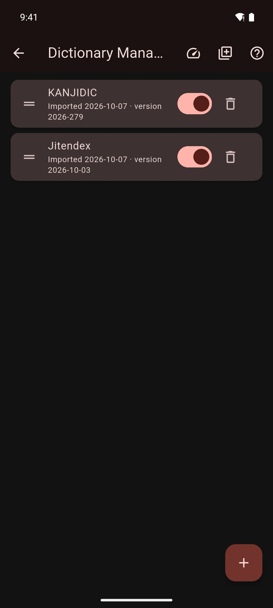

# Managing Dictionaries

Turn dictionaries on and off, change their order, add new ones and delete the ones you do not need.

## Open the Dictionary Manager

Do one of these:

- In the **Dictionary** tab, tap **Manage Dictionaries** (books icon) at the top right.
- Go to **You › Settings › Manage Dictionaries**.

Each row shows the dictionary's name, the date you imported it and, if it has one, its version.

## Turn a dictionary on or off

Use the switch on the dictionary's row. A dictionary that is off stays on your device, but lookups and searches skip it.

## Change the order

Drag a dictionary up or down by the handle on the left of its row.

The order decides whose definitions come first when you look up a word. Put the dictionary you trust most at the top.

## Add a dictionary

### Download one

1. Tap **More dictionaries** (the books icon with a plus) at the top. The **More Dictionaries** screen lists the dictionaries Mekuru can download for you, with their sizes.
2. Tap **Download** next to the one you want.

For the full list, see [More dictionaries](../getting-started/downloadable-data.md#more-dictionaries).

### Import a Yomitan dictionary

Yomitan is a browser extension for reading Japanese, and many free dictionaries come in its format. To import one, tap **+** (**Import Dictionary**) and choose the `.zip` or `.json` file. For the full steps, see [Import a Yomitan dictionary](../getting-started/dictionaries.md#import-a-yomitan-dictionary).

To find dictionaries, tap **Help** (?) in the Dictionary Manager. It links to yomitan.wiki/dictionaries.

## Delete a dictionary

1. Tap the trash icon (**Delete**) on the dictionary's row.
2. Tap **Delete** to confirm.

This deletes the dictionary and all its entries. You cannot undo it. To get the dictionary back, download or import it again.

## After you restore a backup

After a restore, the Dictionary Manager can show **Backup dictionary settings ready**. Install the dictionaries you had before, then tap **Apply Backup Settings**. Mekuru brings back their order and on/off state. Dictionaries you have not installed are skipped.

## If something goes wrong

- **The screen says "No dictionaries imported".** Tap **Browse Downloads** to get dictionaries, or tap **+** to import one.
- **A word has no results.** Check that at least one dictionary is turned on.
- **You see most definitions twice.** You may have both JMdict and Jitendex. Jitendex is built on JMdict, so turn one of them off or delete it.

## Related pages

- [Setting Up Dictionaries](../getting-started/dictionaries.md)
- [Downloads](../getting-started/downloadable-data.md)
- [Looking Up Words](lookups.md)
- [Backup & Restore](../settings/backup-restore.md)
