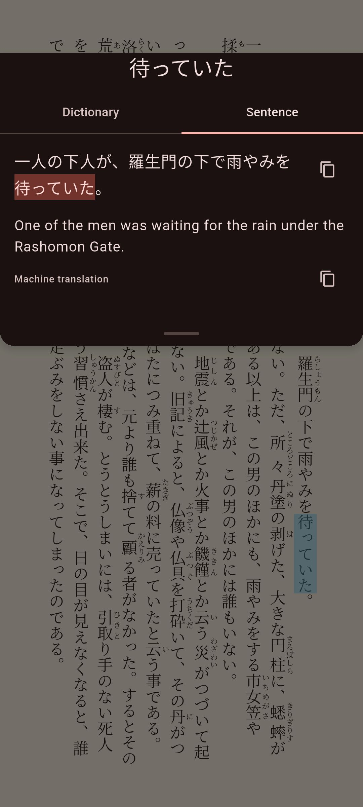

# Sentence Translation

See a translation of the sentence around a word you looked up. Mekuru translates on your device.

## What the Sentence tab shows

When you tap a word in a book or in manga, the lookup sheet has a **Sentence** tab next to **Dictionary**. It shows:

- The whole sentence, with the word you tapped marked.
- A machine translation of the sentence below it.

Use the **Copy** buttons to copy the sentence or the translation. In the manga reader, you can also tap **Edit sentence**. Use it to fix text that OCR (reading the text in an image) got wrong, before the sentence is translated.

The translation runs on your device. The sentence is not sent anywhere, and after the first download you can translate offline.

## Before you start

- Translation needs a one-time download. On Android, this is Mekuru's Japanese translation model (about 55 MB). On iPhone and iPad, it is Apple's Japanese language pack.
- Mekuru translates into the app's language: English, Spanish, Indonesian or Simplified Chinese. To change it, go to **You › Settings › App Language**.

## Translate a sentence

1. Tap a word while you read.
2. In the lookup sheet, tap **Sentence**.
3. The first time, the tab asks for the download. Tap **Download**.

The translation appears below the sentence.

On Android the message is "Download Japanese translation (55 MB) to translate sentences offline." The size is larger when the app is not in English, up to about 107 MB, because those translations go through English.

If you are on mobile data or a hotspot, Mekuru asks "Download over mobile data?" first. Tap **Download** to go ahead, or **Cancel** to wait for Wi-Fi.

!!! note "On iPhone and iPad"
    Mekuru uses Apple's Translation. The tab says "Translating needs Apple's Japanese language pack." Tap **Download**, then accept iOS's prompt to download the language pack.

## Show or hide translations

Go to **You › Settings › Sentence translation** and pick one:

- **Show translation** shows it right away. This is the default.
- **Hide until tapped** covers it. Tap "Tap to show translation" when you want to see it. This lets you try the sentence yourself first.
- **Off** turns translation off. The lookup sheet then shows only the dictionary.

## Choose Standard or High quality

Android has two translation models:

| | **Standard** | **High quality** |
|-|-|-|
| Made by | Mozilla (Firefox Translations) | Google (Gemma 4) |
| Download | About 55 MB in English | 2.6 GB |
| Memory it needs while translating | About 250 MB | About 2 GB |

High quality gives better translations. It loads into memory before its first translation, and again after five minutes without use, so that translation can take a moment.

!!! note "Android only"
    High quality is not available on iPhone and iPad. It also needs a 64-bit Android phone. On other phones, the **Translation model** setting does not appear.

### Switch to High quality

1. Go to **You › Settings › Translation model**.
2. Tap **High quality (2.6 GB)**.
3. If your phone has little memory, Mekuru warns that it may be slow or close. Tap **Continue** to go ahead, or **Use Standard**.
4. If you are on mobile data or a hotspot, Mekuru asks before it downloads.

You need about 3.4 GB of free space: 2.6 GB for the model, plus space it uses the first time it loads. The download goes on in the background, also when you leave Mekuru. The setting shows "High quality: downloading" and a percentage. When the download finishes, Mekuru uses High quality.

You can also start, cancel or remove this download in **You › Settings › Downloads**, under **High-quality translation (Gemma 4)**.

### When High quality is slow

Mekuru gives High quality 45 seconds for a sentence, including the time it takes to load. If it takes longer, Standard translates that sentence, and you see "High quality is taking too long; using Standard for now." High quality keeps loading for your next sentence.

So keep Standard downloaded too. It is the backup whenever High quality is still downloading or cannot load.

### Go back to Standard

Go to **You › Settings › Translation model** and tap **Standard**. If a High quality download is still running, this stops it. Mekuru keeps the part already downloaded, so choosing High quality again picks up where it stopped.

## Remove the translation download

On Android, go to **You › Settings › Downloads**. Tap the trash icon (**Remove**) next to **Japanese translation** or **High-quality translation (Gemma 4)**.

!!! note "On iPhone and iPad"
    iOS manages the language pack, not Mekuru, so you can't remove it in Mekuru.

## Put sentence translations on Anki cards

Your Anki cards can include the translation of the sentence.

1. Go to **You › Settings › AnkiDroid Integration** (on iPhone and iPad: **Anki Integration**).
2. Under **Field Mapping**, tap the field that should hold the translation.
3. Pick **Sentence Translation**.

When you send a word to Anki, Mekuru fills that field with the translation. If translation is not downloaded yet, the field stays empty, and you can type it on the card screen. See [Exporting to Anki](../vocabulary/anki-export.md).

## If something goes wrong

- **"Couldn't translate this sentence."** Tap **Retry**.
- **"This phone may struggle"** Translation needs memory. If Mekuru becomes slow or closes, switch **Translation model** to **Standard**, or set **Sentence translation** to **Off**.
- **"High quality couldn't load. Download Standard to translate this sentence."** Tap **Download** to get Standard as a backup.
- **"High quality download failed"** Mekuru sends this notification when the download fails. Start it again from **You › Settings › Downloads**.
- **"Sentence translation isn't available on this device."** This device cannot run translation.
- **There is no Sentence tab.** **Sentence translation** is set to **Off**, or Mekuru found no sentence around the word.

## Related pages

- [Looking Up Words](lookups.md)
- [Exporting to Anki](../vocabulary/anki-export.md)
- [Downloads](../getting-started/downloadable-data.md)
