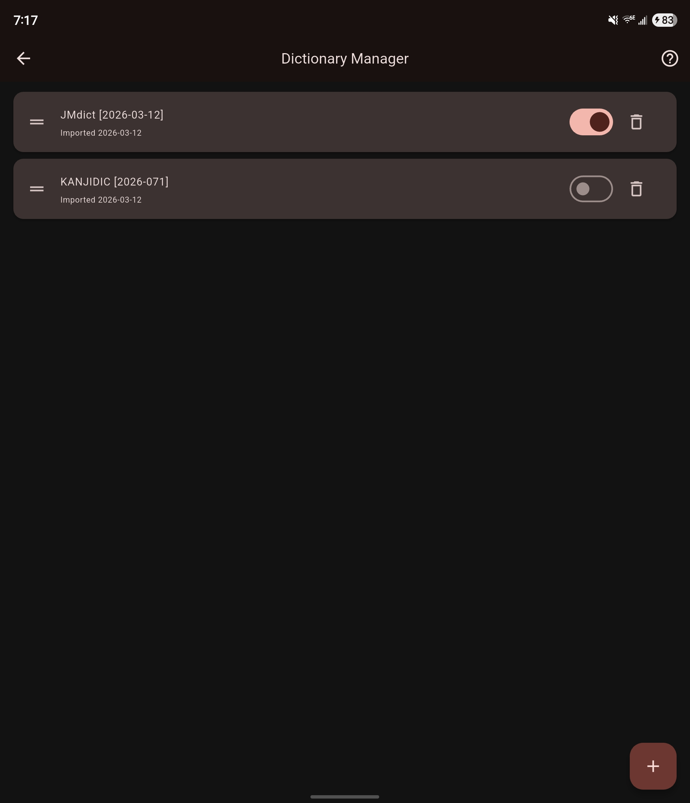

# Setting Up Dictionaries

Mekuru uses offline dictionaries for word lookups. It supports the same Yomitan formats used by the browser extension, plus several built-in downloads.

## Supported Sources

You can add dictionaries in three ways:

- **Yomitan `.zip`** - the standard format used by Yomitan and older Yomichan dictionary packs
- **Yomitan collection `.json`** - a backup export that can contain multiple dictionaries
- **Built-in downloads** - free packs from **Settings > Downloads**, including JMdict and KANJIDIC

## Importing a Dictionary File

1. Open the **Dictionary** tab.
2. Tap the **Manage Dictionaries** button in the top-right corner.
3. Tap **+** in the Dictionary Manager.
4. Select a supported `.zip` or `.json` file.
5. Wait for the import to finish. Large dictionaries can take a moment.

> Tip: You can import multiple dictionaries. Mekuru merges enabled dictionaries into the same lookup workflow and orders them based on the order it appears in the dictionary manager.

## Using Built-in Downloads

If you do not want to find dictionary files manually, open **Settings > Downloads** and install the built-in packs there. Those downloads are imported for you automatically.

## After Import

Once a dictionary is available, it can be used for:

- **Tap-to-lookup** while reading
- **Search** in the Dictionary tab
- **Compound word resolution** for multi-token matches

For enabling, disabling, reordering, or deleting dictionaries, see [Managing Dictionaries](dictionary/management.md).
