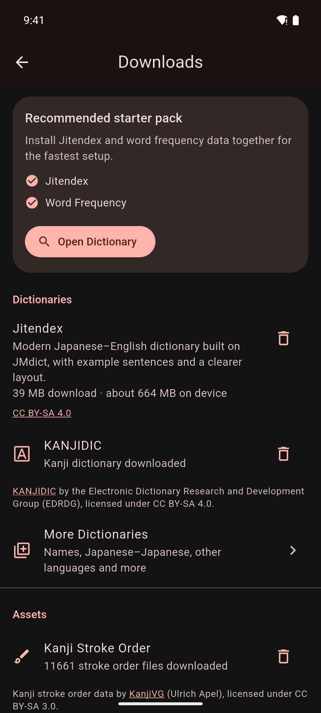

# Downloads

The **Downloads** screen is where you add dictionaries, kanji data, translation models and OCR models. Everything on it is free to download.

To open it, go to **You › Settings › Downloads**. Mekuru also opens it when you tap:

- **Get Dictionaries** in an empty library
- **Browse Downloads** in an empty Dictionary Manager
- **Open Downloads** when a feature needs a download

Sizes below are what the app shows. "On device" is about how much storage an item uses once installed.

## Recommended starter pack

**Install Starter Pack** downloads Jitendex and Word Frequency together, about 45 MB in all. It is the quickest way to start looking up words. See [Setting Up Dictionaries](dictionaries.md).

## Dictionaries

| Item | Size | What it is for |
|-|-|-|
| **Jitendex** | 39 MB download, about 664 MB on device | A modern Japanese–English dictionary built on JMdict, with example sentences and a clearer layout |
| **KANJIDIC** | 0.7 MB download | A kanji dictionary: the meanings and readings of each kanji |
| **More Dictionaries** | Depends on the dictionary | Names, Japanese–Japanese and other languages (see below) |

## More dictionaries

Tap **More Dictionaries** to see the other dictionaries Mekuru can download for you. You can also open this list from the Dictionary Manager with the **More dictionaries** button.

| Section | Dictionary | Download | On device |
|-|-|-|-|
| Japanese–English | Jitendex | 39 MB | about 664 MB |
| Japanese–English | Wiktionary (English) | 16 MB | about 169 MB |
| Japanese–English | JMdict English | about 15 MB, or about 18 MB with example sentences | not shown |
| Japanese–Japanese | Wiktionary (日本語) | 14 MB | about 182 MB |
| Names | JMnedict | 11 MB | about 123 MB |
| Other Languages | JMdict (Español) | 1.3 MB | about 14 MB |
| Other Languages | JMdict (Deutsch) | 6.3 MB | about 67 MB |
| Other Languages | JMdict (Français) | 0.6 MB | about 5.5 MB |
| Other Languages | JMdict (Русский) | 3.5 MB | about 40 MB |
| Other Languages | JMdict (Nederlands) | 3.1 MB | about 36 MB |
| Other Languages | JMdict (Magyar) | 1.8 MB | about 18 MB |
| Other Languages | JMdict (Svenska) | 0.4 MB | about 4.0 MB |
| Other Languages | JMdict (Slovenščina) | 0.3 MB | about 3.1 MB |
| Other Languages | KANJIDIC (Español) | 0.3 MB | about 0.8 MB |
| Other Languages | KANJIDIC (Français) | 0.3 MB | about 0.7 MB |
| Other Languages | KANJIDIC (Português) | 0.3 MB | about 0.6 MB |
| Other Languages | Wiktionary (中文) | 6.9 MB | about 104 MB |

Jitendex is built on JMdict. If you install both, you see most definitions twice. When you download Jitendex while JMdict English is installed, Mekuru asks first. Tap **Replace JMdict** to delete JMdict once Jitendex is installed, or **Download anyway** to keep both.

**Find More Dictionaries**, at the bottom, links to sites that list many more Yomitan dictionaries. Yomitan is a browser extension for reading Japanese, and its dictionary format is widely shared. Download a dictionary's `.zip` file there, then import it. See [Import a Yomitan dictionary](dictionaries.md#import-a-yomitan-dictionary).

## Assets

| Item | Size | What it is for |
|-|-|-|
| **Kanji Stroke Order** | Not shown in the app | Shows how to write a kanji, stroke by stroke, when you search for a single kanji in the **Dictionary** tab |
| **Word Frequency** | about 6 MB download | Shows how common each word is, and lists common words first in search results |
| **Enhanced Furigana Dictionary** | 45 MB download, about 250 MB on device | More accurate furigana readings and word lookups |

Furigana are small kana over kanji that show the reading. The **Enhanced Furigana Dictionary** does not turn them on or off. Once it is installed, a **Use enhanced dictionary** switch appears below it. For how to install it, and what to do if tapping words stops working, see [Install the Enhanced Furigana Dictionary](dictionaries.md#install-the-enhanced-furigana-dictionary-optional). To choose which kanji get furigana, see [Furigana](../reading/furigana.md).

## Translation

These two rows power the **Sentence** tab of the lookup sheet, which translates the sentence around the word you tapped. Mekuru translates into the language the app is shown in. See [Sentence Translation](../dictionary/sentence-translation.md).

| Item | Size | What it is for |
|-|-|-|
| **Japanese translation** | 55 MB if the app is in English; 91 MB in Spanish; 76 MB in Indonesian; 107 MB in Simplified Chinese | Standard sentence translation, offline |
| **High-quality translation (Gemma 4)** | 2.6 GB | Better sentence translations, for phones with plenty of memory |

- **High-quality translation (Gemma 4)** needs a 64-bit Android phone. On other phones, the row doesn't appear.
- For how much memory each model needs and how to switch between them, see [Choose Standard or High quality](../dictionary/sentence-translation.md#choose-standard-or-high-quality).

!!! note "Android only"
    These two rows are not available on iPhone and iPad.

!!! note "On iPhone and iPad"
    Sentence translation uses Apple's built-in translation. The **Sentence** tab asks iOS to download a language pack if it needs one. Apple manages these packs, so they don't appear on the Downloads screen.

## OCR models

OCR means reading the text in an image. These models let Mekuru read manga and scanned books on your device. Downloading them is free. Using on-device OCR needs Pro. See [On-device OCR](../manga/on-device-ocr.md).

| Item | Size | What it is for |
|-|-|-|
| **Japanese manga OCR — manga-ocr** (Android) | 296.2 MB | Needed for on-device OCR on Android |
| **Japanese manga OCR — manga-ocr** (iPhone and iPad) | 201.5 MB | Optional. Apple's text recognition reads manga without it. With it, Mekuru reads the text more accurately |
| **Scanned-book reader — NDLOCR-Lite** | 42.6 MB | Needed to OCR the scanned graded readers from [free books](free-books.md) |

On Android, on-device OCR needs a phone with a 64-bit ARM processor. On other phones, the manga OCR row says so, and the **Scanned-book reader — NDLOCR-Lite** row doesn't appear.

## Wi-Fi and mobile data

- On Wi-Fi, a download starts right away.
- On mobile data or a hotspot, Mekuru first asks **Download over mobile data?** and shows the size. Tap **Download** to go ahead, or **Cancel**. On Android, a Wi-Fi network set as metered counts as mobile data.
- On Android, a VPN hides which network you use, so Mekuru asks **Download through your VPN?** instead.
- A download that started on Wi-Fi stops if Wi-Fi drops. It doesn't continue over mobile data. Tap **Download** (or **Resume**) to try again. OCR models continue from where they stopped.

!!! note "On iPhone and iPad"
    Low Data Mode counts like mobile data, so Mekuru asks first. Dictionary downloads keep going after you leave Mekuru, with their progress in a Live Activity. If you stop the Live Activity, or iOS ends it, the download stops.

On Android, the manga OCR model pack and High-quality translation keep downloading in the background. Other downloads can stop while Mekuru is in the background. You then see **The download stopped because Mekuru was in the background. Tap Download to resume.**

## Remove a download

Tap the trash can icon next to an installed item. Dictionaries, **Kanji Stroke Order**, **Word Frequency** and the **Enhanced Furigana Dictionary** ask you to confirm first. Translation and OCR models are removed right away. You can download any item again later.

Removing the OCR models doesn't remove text that OCR has already added to your books.

You can also delete dictionaries in the Dictionary Manager. See [Managing Dictionaries](../dictionary/management.md).

## Where the data comes from

- **JMdict, JMnedict and KANJIDIC:** the Electronic Dictionary Research and Development Group (EDRDG), CC BY-SA 4.0.
- **Jitendex:** [jitendex.org](https://jitendex.org), built on JMdict.
- **Wiktionary dictionaries:** built from Wiktionary.
- **Kanji Stroke Order:** [KanjiVG](https://kanjivg.tagaini.net/) by Ulrich Apel, CC BY-SA 3.0.
- **Word Frequency:** JPDB (jpdb.io), distributed by Kuuuube.
- **Enhanced Furigana Dictionary:** [UniDic](https://clrd.ninjal.ac.jp/unidic/) by NINJAL.
- **Japanese translation:** Mozilla's Firefox Translations engine and models.
- **High-quality translation:** Google's Gemma 4.
- **Japanese manga OCR:** manga-ocr by kha-white, Apache-2.0.
- **Scanned-book reader:** NDLOCR-Lite by the National Diet Library, Japan, CC BY 4.0.

## Related pages

- [Setting Up Dictionaries](dictionaries.md)
- [Managing Dictionaries](../dictionary/management.md)
- [On-device OCR](../manga/on-device-ocr.md)
- [Sentence Translation](../dictionary/sentence-translation.md)
