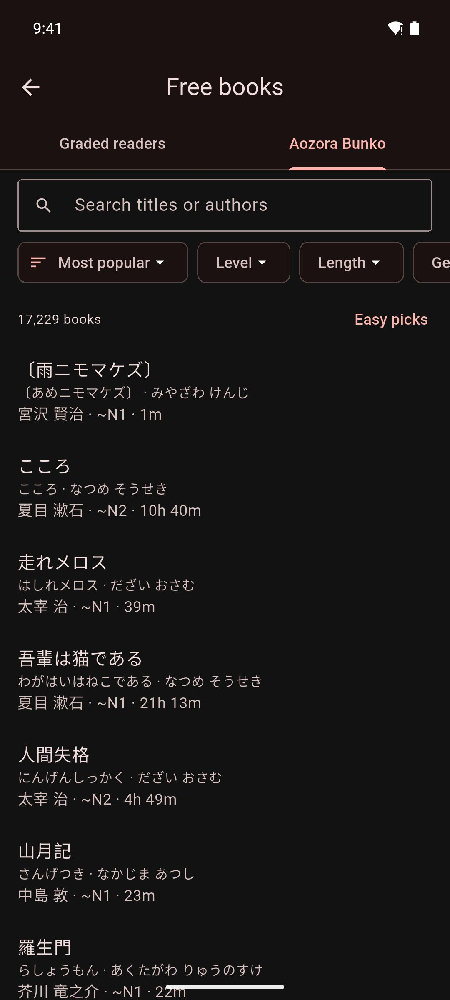

# Free Books

Find free Japanese books in Mekuru and download them straight into your library: graded readers for learners, and classic literature from Aozora Bunko.

## Before you start

- The book lists are built into Mekuru, so you can browse them offline. Graded reader covers load from the internet.
- To download a book, you need an internet connection. Books come straight from Aozora Bunko's site (aozora.gr.jp) and from tadoku.org, so those sites must be reachable.
- Downloading and reading free books is free. Only OCR (reading the text in an image) for scanned graded readers needs Pro.

## Open free books

- Go to **You › Free books**.
- Or, while your library is empty, tap **Browse free books**.

The screen has two tabs: **Graded readers** and **Aozora Bunko**. It reopens on the tab you used last.

## Download a graded reader

Graded readers are short books written for learners, sorted into levels. Mekuru lists about 140 of them, made by NPO Tadoku Supporters.

The levels go from **Start**, the easiest, through L0 up to L5. Levels L1 to L5 also show the JLPT level that tadoku.org gives them, for example **L2 · N4**. JLPT is the Japanese-Language Proficiency Test, from N5 (easiest) to N1 (hardest).

To find and download a graded reader:

1. Open the **Graded readers** tab.
2. Tap a level to show only books at that level. Tap more levels to add them.
3. To search by title, type in **Search graded readers**.
4. Tap a cover to see the book's details, such as its number of pages and characters.
5. Tap **Download**.

Some graded readers have audio. You can play it on tadoku.org: tap **View on tadoku.org** in the book's details.

### Scanned graded readers

Some graded readers are pictures of pages, like a scan. They show **Pages only** on the cover. You can read them, but you can't tap their words until OCR reads the text.

To make the words tappable:

1. Make sure you have Pro.
2. Open **You › Settings › Downloads** and download **Scanned-book reader — NDLOCR-Lite**, the NDL text model (42.6 MB). On Android, also download the manga OCR model pack, **Japanese manga OCR — manga-ocr**.
3. In your library, press and hold the book, then tap **Recognize text**.
4. Tap the button that starts the scan, for example **Recognize 24 pages**.

Scanned free books always use on-device OCR, even if you usually use your own OCR server. See [On-device OCR](../manga/on-device-ocr.md).

## Download from Aozora Bunko

Aozora Bunko (青空文庫) is a free online library of Japanese books whose copyright has expired. Volunteers typed in every book. Mekuru lists more than 17,000 of them.

The tab opens on **Easy picks**: books with the easiest estimated levels (~N5 to ~N3) in modern spelling, most popular first.

To find and download a book:

1. Open the **Aozora Bunko** tab.
2. To search, type a title or author in **Search titles or authors**.
3. To sort, tap the first chip, which shows the current order. Choose **Most popular**, **Easiest first**, **Hardest first**, **Shortest first**, **Longest first**, **Title (kana order)** or **Author (kana order)**.
4. To filter, tap **Level**, **Length**, **Genre** or **Spelling**, and tick what you want. You can tick more than one.
5. Tap a book to see its details: length, estimated level, spelling and genre.
6. Tap **Download**.

Above the list, Mekuru shows how many books match. When filters are on, tap **Clear filters** to see every book. With no filters on, tap **Easy picks** to go back to the starting view.

### What the filters mean

- **Level:** an estimated JLPT level, such as **~N3**, or **Beyond N1** for the hardest books. Mekuru estimates it from each book's kanji and sentence length. It is not an official JLPT rating.
- **Length:** the reading time at a typical learner's pace, from **Under 10 min** to **Over 3 hours**.
- **Genre:** for example **Fiction**, **Children's stories** or **Essays**.
- **Spelling:** **Modern**, **Pre-war kana**, **Pre-war kanji and kana** or **Other**. Pre-war spelling uses old kana or old kanji forms, which is much harder for learners.

## After you download

- Mekuru says the book was added to your library. Tap **Read** to open it.
- In the book's details, **Download** changes to **Read**.
- Books you already have show a check mark. To hide them, turn on **Hide books in my library**.
- Aozora Bunko books become EPUB books in vertical text, with their original furigana (small kana over kanji that show the reading). The volunteers' credits are on the last page.
- Graded readers are PDF files. You read them page by page, like manga. Scanned ones show **This PDF looks like a scan**; see [Scanned graded readers](#scanned-graded-readers).
- You can leave the Free books screen while a book downloads.

!!! note "On iPhone and iPad"
    A download keeps going after you leave Mekuru, and its progress shows in a Live Activity. If you stop the Live Activity, or iOS ends it, the download stops.

## If something goes wrong

- **Couldn't download the book. The site may be busy or your connection dropped; try again.** Check your connection. The book's site (aozora.gr.jp or tadoku.org) may also be down for a while.
- **Mekuru couldn't add this book to your library.** Try again. If it keeps happening, report it with **You › Settings › Send Feedback**.
- **No books match. Try clearing some filters.** Tap **Clear filters**, or change your search.

## Credits

- **Aozora Bunko:** a free library of Japanese books typed in by volunteers. Each book keeps their credits on its last page. Visit [aozora.gr.jp](https://www.aozora.gr.jp/).
- **Graded readers:** by NPO Tadoku Supporters (NPO多言語多読), free under [CC BY-NC-ND 4.0](https://creativecommons.org/licenses/by-nc-nd/4.0/). Mekuru downloads each book from [tadoku.org](https://tadoku.org/japanese/), unchanged.

## Related pages

- [Importing Books (EPUB and PDF)](importing-books.md)
- [On-device OCR](../manga/on-device-ocr.md)
- [Looking Up Words](../dictionary/lookups.md)
- [Downloads](downloadable-data.md)
