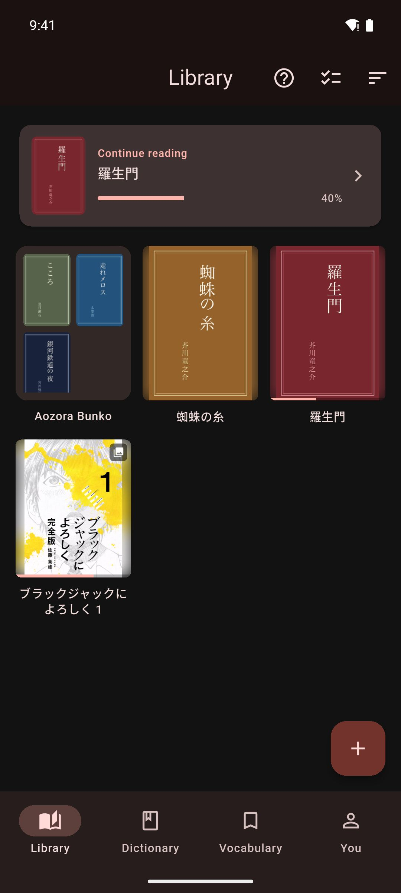

# Welcome to Mekuru

Mekuru (めくる, "to turn a page") is a free app for reading Japanese books and manga while you learn. Tap a word you don't know to see what it means, then save it to review later.

## What Mekuru does

- **Manga you can tap.** Import manga that mokuro has processed and tap any word. Mokuro is a free tool that adds the text to manga pages. For other manga, OCR (reading the text in an image) adds the text in the app. OCR is part of Pro. See [Importing Manga](getting-started/importing-manga.md).
- **Vertical novels with furigana.** EPUB books written in tategaki (vertical writing) open that way. Furigana are small kana over kanji that show the reading. Show them for all kanji, only for kanji above your JLPT level, or only for kanji you haven't learned on WaniKani. The JLPT (Japanese-Language Proficiency Test) goes from N5, the easiest, to N1, the hardest. See [Furigana](reading/furigana.md).
- **An offline dictionary.** Mekuru keeps your dictionaries on your device, so lookups work without a connection. See [Looking Up Words](dictionary/lookups.md).
- **Sentence translation.** The **Sentence** tab of the lookup sheet translates the whole sentence on your device. See [Sentence Translation](dictionary/sentence-translation.md).
- **Vocabulary and Anki.** Save words together with the sentence you found them in, then send them to Anki as flashcards. See [Saving & Managing Words](vocabulary/saving-words.md) and [Exporting to Anki](vocabulary/anki-export.md).
- **Free books.** Download graded readers for learners and classic literature from Aozora Bunko, right in the app. See [Free Books](getting-started/free-books.md).
- **Reading stats.** See how long you read, which days you read, and how your vocabulary grows. See [Reading Stats](stats/reading-stats.md).
- **Book servers.** Download books from your own Komga or Kavita server and keep your reading position in sync. See [Book Servers](library/book-servers.md).

## Where Mekuru runs

- **Android:** install Mekuru from [Google Play](https://play.google.com/store/apps/details?id=moe.matthew.mekuru).
- **iPhone and iPad:** Mekuru is coming to the App Store. Until then, join the beta on [TestFlight](https://testflight.apple.com/join/3HegxezW). It needs iOS 26 or newer.

[Installing Mekuru](getting-started/installing-mekuru.md) has the details.

A few features work differently on iPhone and iPad. Pages point these out in notes marked **On iPhone and iPad** or **Android only**.

## Start here

1. **Install Mekuru.** See [Installing Mekuru](getting-started/installing-mekuru.md).
2. **Get dictionaries.** Tap **Get Dictionaries** in your empty library. It installs the starter pack: a Japanese–English dictionary plus word frequency data. See [Setting Up Dictionaries](getting-started/dictionaries.md).
3. **Get something to read.** Import your own [books](getting-started/importing-books.md) or [manga](getting-started/importing-manga.md), or download [free books](getting-started/free-books.md).
4. **Tap a word.** Open a book and tap any word. The lookup sheet opens with its meaning. See [Looking Up Words](dictionary/lookups.md).

## Free and Pro

Mekuru is free. Pro is a one-time purchase. Pro unlocks [**On-device OCR**](manga/on-device-ocr.md), [**Auto-Crop**](manga/cbz-reading.md#trim-empty-margins-with-auto-crop-pro) for manga margins, **Book Highlights** for EPUB books, and [**Custom OCR Server**](manga/custom-server.md).

You buy Pro through Google Play on Android and through the App Store on iPhone and iPad. You don't need an account.

## Get help

Email [mekuru@matthew.moe](mailto:mekuru@matthew.moe) with questions or problems. You can also send a bug report or an idea from inside the app with **You › Settings › Send Feedback**.
