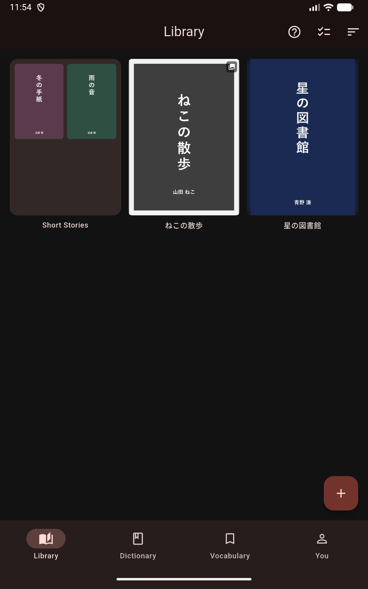

# Collections & Folders

Collections group your books and manga into iOS-style folder tiles on the library grid, so a large library stays organized without moving anything out of it.

## Creating a Collection

1. Long-press a book or manga in the **Library** tab.
2. Choose **Add to collection**.
3. Pick an existing collection, or tap **New collection** and name it.

The collection appears in the library grid as a folder tile showing miniature covers of the books inside.

## Adding Several Books at Once

Tap the checklist icon in the library app bar to enter selection mode, tap the books you want (or **Select all**), then use **Add to collection** to move the whole selection in one step.

## Opening and Reordering

Tap a folder tile to open the collection. Each collection keeps its own book order — inside a folder, enter edit mode with the **Select** icon and drag tiles to rearrange them. The order is saved per collection and does not affect the main library sort.

## Removing Books and Managing Collections

- Inside a folder, enter edit mode, select one or more books, and choose **Remove from this folder**. The books stay in your library — only the collection membership is removed.
- Long-press a folder tile to rename or delete the collection. Deleting a collection never deletes the books in it.

## Backup

Collections — including each collection's book order — are included in [Backup & Restore](../settings/backup-restore.md).
