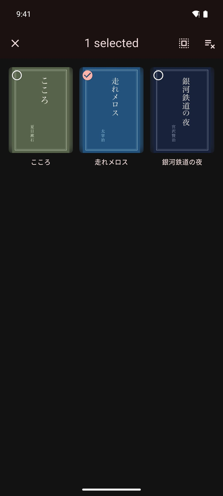

# Collections & Folders

Group books and manga into folders on your library grid, for example by series or by level.

## How collections work

- Each collection is a folder on the **Library** tab. Folders come first on the grid, sorted by name. The books that are in no folder follow.
- A book in a collection appears inside its folder, not on the main grid.
- A book can be in more than one collection.
- A folder shows the covers of its first four books.
- Deleting a collection never deletes the books in it.

## Create a collection

1. In the **Library** tab, press and hold a book.
2. Tap **Add to collection**.
3. Tap **New collection**.
4. Type a name and tap **Save**.

Mekuru creates the folder and puts the book in it.

## Add books to a collection

To add one book:

1. Press and hold the book.
2. Tap **Add to collection**.
3. Check each collection the book belongs in. Each change is saved right away.

To add several books at once:

1. Tap **Select** (the checklist icon) at the top of the **Library** tab.
2. Tap the books you want, or tap **Select all**.
3. Tap **Add to collection** (the folder icon).
4. Check one or more collections, or tap **New collection** to make one.
5. Tap **Add**.

On the main grid you can only select books that are in no folder yet. To add a book that is already in a folder to another collection, open the folder and press and hold the book.

New books go to the end of a collection.

## Open a collection

Tap a folder to open it. Tap a book to read it, or press and hold it for the same options as on the main grid.

## Edit a collection

1. Open the collection.
2. Tap **Select** (the checklist icon) at the top. The collection is now in edit mode.
3. Do any of these:
    - **Reorder**: press and hold a book, then drag it to a new place. The order applies to this collection only. The first four books are the covers on the folder.
    - **Remove**: tap the books to select them, then tap **Remove from this folder**. If you selected more than one book, tap **Remove** to confirm.
4. Tap **Close** (the X) to leave edit mode.

Removed books stay in your library. A book that is in no other folder goes back to the main grid.

To remove one book without edit mode, press and hold it, tap **Add to collection**, and clear its check box.

### Rename or delete a collection

1. Press and hold the folder on the library grid. Inside the collection, you can also tap the menu button (⋮) at the top.
2. Tap **Rename** or **Delete**.
3. To rename, type the new name and tap **Save**. To delete, tap **Delete** again to confirm.

The books in a deleted collection stay in your library.

## Sort the library

1. Tap the sort button at the top of the **Library** tab.
2. Under **Sort by**, choose one:
    - **Date imported**: newest books first. This is the default.
    - **Recently read**: the book you opened last comes first. Books you have never opened go last.
    - **Alphabetical**: by title, A to Z.

Mekuru remembers your choice. The sort applies to the books on the main grid. Folders stay first, sorted by name, and books inside a collection keep the order you gave them.

## Continue reading

After you have opened a book, a **Continue reading** card appears at the top of the **Library** tab. It shows the book you read most recently, including books inside folders, with how far you are as a bar and a percentage. Tap the card to open the book where you stopped.

## Related pages

- [Importing Books (EPUB and PDF)](../getting-started/importing-books.md)
- [Importing Manga](../getting-started/importing-manga.md)
- [Backup & Restore](../settings/backup-restore.md): backups keep your collections and the order of books in each.
