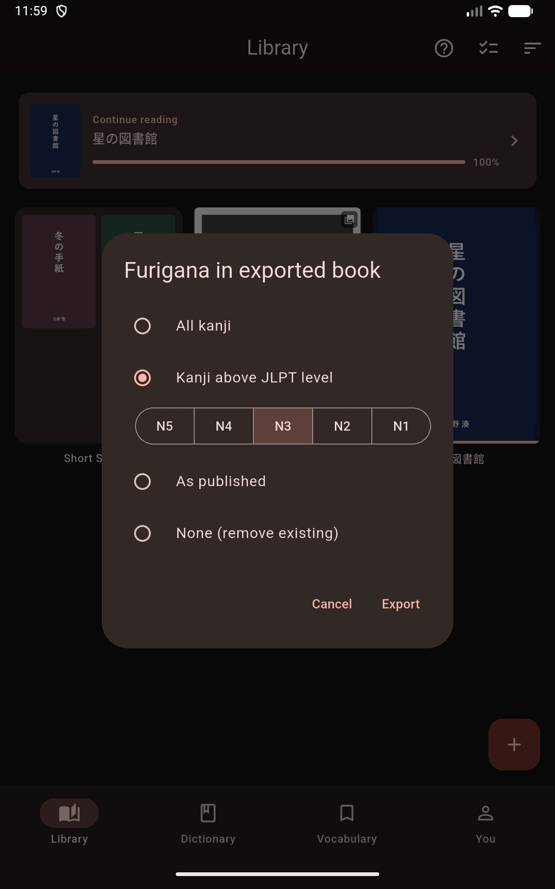

# Furigana EPUB Export

Mekuru can export a copy of any EPUB in your library with furigana baked into the file, so you can read it with readings in any other EPUB reader — or share a furigana-free copy of a book that shipped with ruby text.

## How to Export

1. Long-press the book in the **Library** tab.
2. Choose **Export as EPUB**.
3. Pick how furigana should appear in the exported book:
    - **All kanji** - generate furigana for every kanji word
    - **Kanji above JLPT level** - generate furigana only for kanji above a JLPT level; an N5-N1 picker appears, preset to your reader's furigana level
    - **Kanji not yet known on WaniKani** - generate furigana only for words with a kanji you have not learned yet, using the reader's **Hide furigana at** stage; offered once a linked WaniKani account has synced
    - **As published** - keep the book's original ruby text unchanged
    - **None (remove existing)** - strip all ruby text from the book
4. Tap **Export**, wait for **Preparing EPUB**, then choose where to save the file.

The exported file is a standard EPUB — nothing about it requires Mekuru.

## Notes

- The **Kanji above JLPT level** and **Kanji not yet known on WaniKani** modes apply the same rule to furigana the publisher included: ruby stays only on kanji you do not know yet.
- Furigana generation uses Mekuru's built-in analyzer. If you see **Furigana engine is unavailable**, wait a moment after app launch and try again.
- Generated readings are more accurate with the [Enhanced Furigana Dictionary](../getting-started/downloadable-data.md#furigana-word-analysis) installed.
- The original book in your library is never modified — export always writes a new file.

For furigana while reading inside Mekuru, see [Furigana](../reading/furigana.md).
