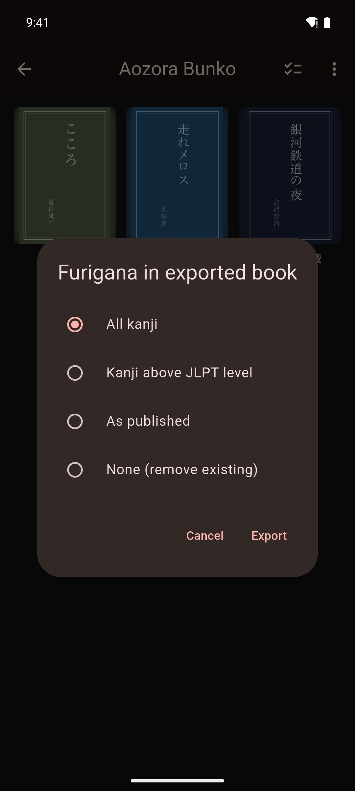

# Furigana EPUB Export

Save a copy of an EPUB from your library with furigana built into the text, so the readings show in any EPUB reader.

Furigana are the small kana printed above kanji to show how they are read. The export can also remove the furigana a book came with.

## Before you start

- Export works for EPUB books. Manga and PDFs do not have this option.
- For more accurate readings, install the **Enhanced Furigana Dictionary** from **You › Settings › Downloads**.

## Export a book

1. In the **Library** tab, press and hold the book.
2. Tap **Export as EPUB**.
3. Under **Furigana in exported book**, choose an option from the table below.
4. Tap **Export**. Mekuru shows **Preparing EPUB…** while it builds the file.
5. Choose a folder and save the file. Its name is the book title followed by "(furigana).epub".

Mekuru shows **EPUB exported** when the file is saved. The book in your library does not change.

!!! note "On iPhone and iPad"
    The Files picker opens for step 5. Choose a folder, for example in iCloud Drive or On My iPhone, and confirm.

## Furigana options

JLPT levels come from the Japanese-Language Proficiency Test: N5 is the easiest, N1 the hardest.

| Option | What the exported book contains |
|-|-|
| **All kanji** | Furigana on every word with kanji. Furigana the publisher added stays. |
| **Kanji above JLPT level** | Furigana only on words with kanji above the level you pick (N5 to N1). The picker starts at your reader's furigana level. Publisher furigana on easier words is removed. |
| **Kanji not yet known on WaniKani** | Furigana only on words with a kanji you have not learned on WaniKani. Publisher furigana on words you know is removed. |
| **As published** | An unchanged copy of the book. |
| **None (remove existing)** | No furigana at all. |

**Kanji not yet known on WaniKani** appears only after you link a WaniKani account in **You › Settings › WaniKani** and its kanji have synced. A kanji counts as known once it reaches the stage chosen in the reader's **Hide furigana at** setting.

## If something goes wrong

- **Furigana engine is unavailable — try again in a moment**: Mekuru's Japanese text analyzer is still starting. Wait a few seconds and export again.
- No file appears: if you close the save screen without choosing a folder, nothing is saved. Export the book again.

## Related pages

- [Furigana](../reading/furigana.md): furigana while you read in Mekuru, including WaniKani.
- [Downloads](../getting-started/downloadable-data.md): the Enhanced Furigana Dictionary.
