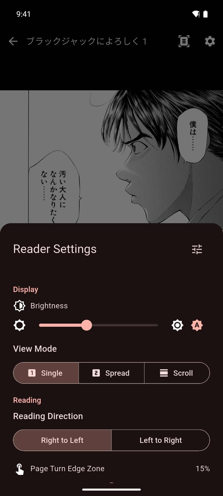

# Reading Manga

Read manga page by page, choose how pages are shown, and tap words to look them up.

## Before you start

- Import a manga first. See [Importing Manga](../getting-started/importing-manga.md).
- To tap words, the pages need text. Manga made with mokuro (a tool that adds OCR text to manga pages) already have it, and reading them is free. For other manga, Pro can add the text with [on-device OCR](on-device-ocr.md) or [remote OCR](cloud-ocr.md). OCR means reading the text in an image.

## Open a manga

1. Open the **Library** tab.
2. Tap the manga.

Mekuru opens it at the page where you stopped. PDFs open in the same reader.

## Turn pages

- Tap near the left or right edge of the screen.
- Or swipe left or right.

Tap the middle of the page to show or hide the controls.

Most Japanese manga read **Right to Left**, which is the default. The next page is then on the left: tap the left edge, or swipe from left to right. In a **Left to Right** manga it is the other way round.

## Jump to a page

1. Tap the middle of the page to show the controls.
2. Drag the slider at the bottom of the screen. It shows the page you are on and the total number of pages.

In a right-to-left manga the slider also runs from right to left.

## Choose a view mode

1. Tap the middle of the page to show the controls.
2. Tap the gear icon (**Settings**) at the top of the screen.
3. Under **View Mode**, choose one:
    - **Single**: one page at a time.
    - **Spread**: two pages side by side, like an open book. The cover is shown on its own.
    - **Scroll**: all pages in one long vertical strip. Scroll up and down to read. In this mode, tapping the page only shows or hides the controls.

## Change the reading direction

In the reader settings, under **Reading Direction**, choose **Right to Left** or **Left to Right**.

This choice applies to all your manga. A PDF is the exception: the direction you choose in a PDF applies to that PDF only.

## Zoom in

- Pinch with two fingers to zoom in, up to five times the page size.
- Drag with one finger to move around the page.
- Pinch again to zoom back out.

While you are zoomed in, tapping the edge does not turn the page. Drag past the edge of the page to go to the next one.

## Look up a word

On a page that has text, tap a word. The lookup sheet opens with the dictionary entries, and the word is highlighted on the page. If the word is in the lower half of the screen, the sheet opens at the top so it does not cover the word.

A page has text when:

- the manga was made with mokuro, or is a CBZ (a zip of comic page images) that includes mokuro text;
- the PDF was made from text, like most ebooks;
- you added the text with on-device OCR or remote OCR (Pro).

To learn more about the lookup sheet, see [Looking Up Words](../dictionary/lookups.md).

## Reader settings

Tap the gear icon at the top of the reader to open **Reader Settings**. It has four groups.

**Display**

- **Brightness**: the screen brightness while you read. Tap the button next to the slider to **Follow system brightness** again.
- **View Mode**: **Single**, **Spread** or **Scroll**.

**Reading**

- **Reading Direction**: **Right to Left** or **Left to Right**.
- **Page Turn Edge Zone**: how much of each side of the screen turns the page when you tap it, from 5% to 25%. The default is 15%.

**Image**

- **Auto-Crop** (Pro): removes empty margins. See the next section.

**Lookup**

- **Transparent Lookup**: makes the lookup sheet see-through, so you can still see the page behind it. It is on by default.
- **Debug Word Overlay**: draws a box around every word Mekuru found on the page. Use it to check where the text is when a tap picks the wrong word.

The **All settings** button at the top of the sheet opens **Reader Settings** in **You › Settings**. The manga settings there are the same ones.

## Trim empty margins with Auto-Crop (Pro)

Auto-Crop cuts the empty white margins around each page, so the art fills more of the screen.

1. In the reader, tap the gear icon.
2. Under **Image**, turn on **Auto-Crop**.
3. The first time, Mekuru asks to scan every page of this manga. Tap **Continue** and wait. This can take a minute.

**Auto-Crop** is one switch for all your manga, but Mekuru scans each manga separately. If another manga still shows its margins, open it, then turn **Auto-Crop** off and on again to scan it.

If Auto-Crop cuts too much or too little:

1. Open **You › Settings › Reader Settings**.
2. In the **Manga** section, change **White Threshold**. Lower values ignore more near-white marks in the margins. The default is 240.
3. Go back to the manga, open the reader settings and tap **Re-run Auto-Crop**.

Without Pro, the **Auto-Crop** row shows **Unlock**, which opens the Pro screen.

## If something goes wrong

- **Tapping a word does nothing.** The page has no text yet. Add it with [on-device OCR](on-device-ocr.md) or [remote OCR](cloud-ocr.md).
- **Tapping the edge does not turn the page.** You are zoomed in, or the manga is in **Scroll** view. Pinch to zoom out, or scroll instead.
- **Page turns feel slow on an e-ink screen.** Turn off **Animations** in **You › Settings › Reader Settings**. Pages then change instantly.

!!! note "Android only"
    **Volume buttons turn pages** (in **You › Settings › Reader Settings**) lets you turn manga pages with the volume buttons. This feature is not available on iPhone and iPad.

## Related pages

- [Importing Manga](../getting-started/importing-manga.md)
- [On-device OCR](on-device-ocr.md)
- [Remote OCR (Pro)](cloud-ocr.md)
- [Looking Up Words](../dictionary/lookups.md)
- [App Settings](../settings/app-settings.md)
