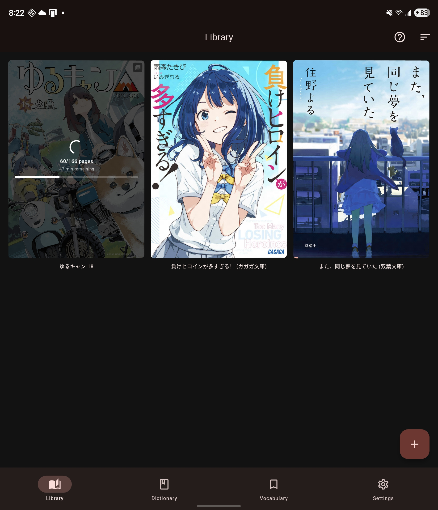

# Remote OCR

> **Pro feature** - Remote OCR requires the one-time **Pro** upgrade.

Remote OCR extracts text from CBZ manga pages so you can tap words and look them up.

[On-device OCR](on-device-ocr.md) is the other Pro option: it uses models
downloaded to your phone and needs no server.

## How the Workflow Works

1. Import a `.cbz` file from the **Library** tab.
2. Open **Settings > Reader Settings > Manga > Custom OCR Server** and enter your own server URL plus shared key. (Settings is behind the gear icon on the **You** tab.)
3. Long-press the manga item in the library.
4. Choose **Recognize text → Remote**, then select the pages to process.
5. Mekuru uploads page images to your configured server and processes pages in the background.
6. Once text overlays are available, open the manga and tap the detected words.

## Background Processing

OCR runs in the background, so it can continue after you leave the library screen.

Use the recognition sheet and the library progress overlay to manage work:

- **Resume OCR** - continue a partial pass
- **Pause OCR** - pause the background job and keep completed work
- **Delete OCR** - remove OCR text and overlays; for replaced Mokuro/HTML books this restores the original imported OCR
- Word overlays are repaired when the reader loads existing OCR with missing or stale word segmentation.

## Pro Access

- Pro is a one-time purchase.
- Restoring or buying Pro can require linking a Google account first.
- The Settings screen can show **Sign In to Restore Pro** until that link is complete.

## Lookup Integration

Once OCR text is available, the detected words behave like Mokuro overlays and open the same dictionary lookup sheet used elsewhere in the app.

## Server Setup

Remote OCR requires a self-hosted OCR server. See the [Custom OCR Server](custom-server.md) guide for setup instructions.
