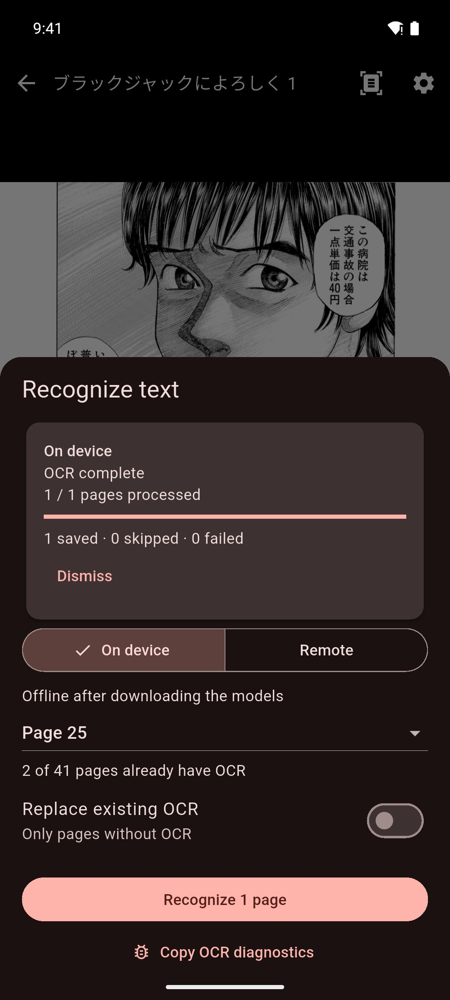
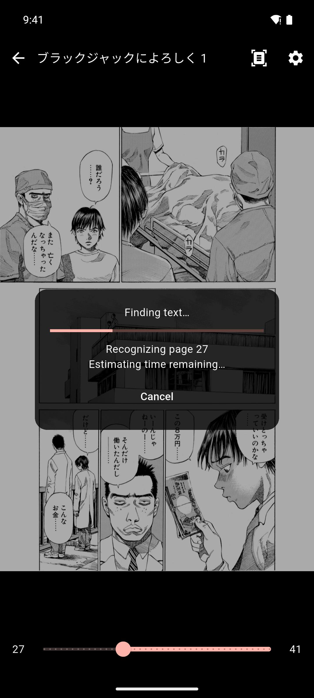

# On-device OCR

On-device OCR (Pro) reads the Japanese text in your manga pages, so you can tap the words to look them up. OCR means reading the text in an image. It runs on your device and works offline, so your page images never leave it.

## Before you start

You need:

- **Mekuru Pro**. If you start a scan without Pro, Mekuru opens the Pro screen. See [App Settings](../settings/app-settings.md#pro).
- **The manga OCR model pack**, a free download of about 296 MB. You do not need Pro to download it.
- On Android, a phone or tablet with a 64-bit ARM processor. A scan needs about 1 GB of free memory.

To download the manga OCR model pack:

1. Open **You › Settings › Downloads**.
2. Find **Japanese manga OCR — manga-ocr** and tap **Download**.

Mekuru downloads over Wi-Fi. On mobile data, it asks first. If the download stops, tap **Resume**: it continues where it stopped.

!!! note "On iPhone and iPad"
    You can scan without downloading anything: Apple's text recognition finds and reads the text. The manga OCR model pack (about 202 MB) is optional. It reads manga text more accurately. Download it from the same row in **Downloads**.

### Check your phone's speed first

Scanning is heavy work. Speed varies a lot from phone to phone, and it uses a lot of battery. **Test device speed** scans a sample page and shows the time per page and an estimate for a 200-page volume.

You find **Test device speed** in two places:

- on the Pro screen (**You › Settings › Pro**), in the **On-device OCR** card;
- in **Downloads**, under **Japanese manga OCR — manga-ocr**, once the model pack is installed.

The test needs the model pack installed, but not Pro.

!!! note "Android only"
    **Test device speed** is not available on iPhone and iPad.

## Scan the page you are reading

1. Open the manga and tap the middle of the page to show the controls.
2. Tap the scan icon at the top of the screen, next to the gear icon.

The first time, the **Recognize text** sheet opens so you can choose how to scan. See the next section.

After that, one tap scans the pages on screen right away, with the method you used last. A message confirms it, for example "Recognizing page 12 on device". Tap **Options** in the message to open the **Recognize text** sheet instead.

If the pages on screen already have text, Mekuru says "This page already has OCR". Tap **Replace existing OCR** in that message to scan them again.

## Choose what to scan

The **Recognize text** sheet lets you scan one page or the whole manga. To open it, do one of these:

- In the reader, press and hold the scan icon.
- In the **Library**, press and hold the manga, then tap **Recognize text**.

1. Choose **On device**. (**Remote** sends the pages to your own OCR server. See [Remote OCR (Pro)](cloud-ocr.md).)
2. Choose the pages:
    - a single page, such as **Page 12**. In **Spread** view, each page on screen is listed.
    - **Entire manga**. From the library, the sheet always scans the entire manga.
3. Leave **Replace existing OCR** off to scan only pages that have no text yet. The sheet shows how many pages already have text.
4. Turn on **Replace existing OCR** to scan the chosen pages again. The old text of a page stays until its new text is saved.
5. On Android, when you scan the entire manga, you can tick **Only while charging**.
6. Tap **Recognize 1 page** or **Recognize** followed by the number of pages.

You can keep reading while Mekuru scans. Words become tappable as each page is finished.

## Follow, pause and resume a scan

### On Android

You can follow the scan in several places:

- A dark panel over the page you are on, while that page is being scanned. It shows the progress and the time left, with **Cancel**.
- The **Recognize text** sheet, with the number of pages saved, skipped and failed.
- The manga's cover in the **Library**.
- A notification, with **Pause** and **Cancel**. Mekuru may ask to show notifications. The scan runs either way.

The scan keeps running in the background when you leave Mekuru.

- **Pause** stops the scan and saves its progress. Tap **Resume** in the **Recognize text** sheet to go on.
- **Cancel scan** stops the scan for good. Pages that are already done keep their text.
- If some pages failed, tap **Retry failed pages**. Open **Page errors** to see what went wrong.

Mekuru pauses a scan by itself when:

- the phone is low on memory. Close other apps, then resume.
- the phone is too hot. Let it cool, then resume.
- the battery is below 15% and the phone is not charging.
- you chose **Only while charging** and unplugged the phone.

Android can also stop long background work, and a restart stops it too. Your progress is saved: open the **Recognize text** sheet and tap **Resume**.

### On iPhone and iPad

- A panel at the bottom of the reader shows the progress, with **Pause**.
- The manga's cover in the **Library** shows the progress too.

The scan keeps going after you leave Mekuru, and iOS shows its progress in a Live Activity. If you stop the Live Activity, or iOS ends it, the scan pauses. If Mekuru is closed, the scan stops.

To continue a paused or stopped scan, open the **Recognize text** sheet and tap **Recognize** again. Pages that already have text are skipped.

## Scan graded readers from free books

Some graded readers in **Free books** are scans: photos of printed pages, with no text inside. To tap their words, scan them with on-device OCR. This also needs Pro.

These books need the NDL text model (42.6 MB). It reads their long lines of text much more accurately.

1. Open **You › Settings › Downloads**.
2. Find **Scanned-book reader — NDLOCR-Lite** and tap **Download**.

If the NDL text model is missing when you start a scan, Mekuru says **Scanned-book reader needed**. Tap **Open Downloads**.

Free books are always scanned on your device: the **Recognize text** sheet has no **Remote** choice for them. On Android you need the manga OCR model pack as well.

A scanned PDF that you import yourself is scanned like a manga. When you import one, Mekuru tells you that it looks like a scan.

## Remove the models or the text

- **Remove a model**: in **Downloads**, tap **Remove** on its row. Text you already recognized stays in your manga.
- **Delete the text of a manga**: in the **Library**, press and hold the manga, then tap **Delete OCR**. For a manga made with mokuro (a tool that adds OCR text to manga), this brings back its original mokuro text. For a PDF, the text that came with the PDF stays.

## If something goes wrong

- **"On-device OCR requires a supported 64-bit ARM Android device."** Your device cannot run on-device OCR. Use [remote OCR](cloud-ocr.md) instead.
- **The Recognize button is grayed out.** Every page you chose already has text. Turn on **Replace existing OCR**.
- **"The model files failed verification."** Remove the manga OCR model pack in **Downloads** and download it again.
- **"This manga already has an OCR job."** Pause or cancel the scan that is running before you start another.
- **"There is not enough free storage to continue."** Free some space on your device, then resume.

Model credits and licenses are in **You › Settings › About Mekuru › Attributions**.

## Related pages

- [Reading Manga](cbz-reading.md)
- [Remote OCR (Pro)](cloud-ocr.md)
- [Downloads](../getting-started/downloadable-data.md)
- [Importing Manga](../getting-started/importing-manga.md)
