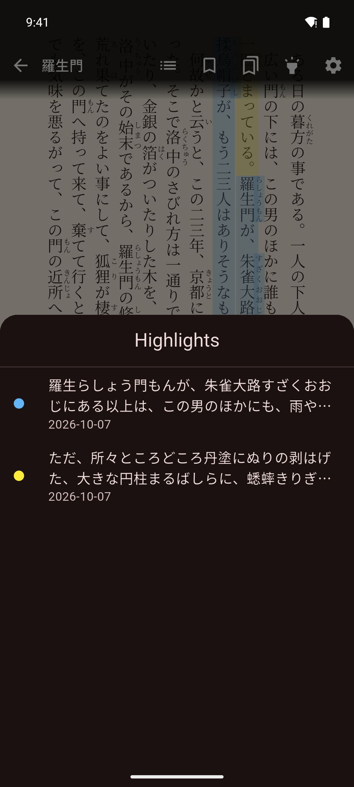

# Bookmarks & Highlights

Save pages to come back to, and mark passages in color while you read an EPUB book.

## Before you start

- Bookmarks are free.
- Highlights need Pro. See **You › Settings › Pro**.
- Both work in EPUB books only.

## Bookmarks

### Bookmark a page

1. Tap an empty spot in the middle of the page to show the controls.
2. Tap **Bookmark Page** (bookmark icon) at the top.

The icon fills in and "Page bookmarked" appears.

### Go back to a bookmark

1. Show the controls.
2. Tap **View Bookmarks** (the icon next to the bookmark icon).
3. Tap a bookmark.

Each bookmark shows how far into the book it is, as a percentage, and the date you added it.

To see a book's bookmarks from the library, press and hold the book and tap **Bookmarks**. Tap one to open the book at that page.

### Remove a bookmark

Do one of these:

- On the bookmarked page, tap the bookmark icon again (**Remove Bookmark**).
- In the bookmarks list, swipe the bookmark to the left.

## Highlights

### Highlight a passage

1. Press and hold a word in the book to select it.
2. Drag the selection handles to cover the passage.
3. Tap the highlighter button at the bottom right (**Highlight selection**).
4. To mark the whole sentence, tap **Select sentence**. This step is optional.
5. Tap a color: yellow, blue, green or pink.

Without Pro, the highlighter button opens the Pro screen instead.

Your highlights show in the text every time you open the book.

### See your highlights

1. Show the controls.
2. Tap **Highlights** (highlighter icon) at the top.

Each highlight shows its color, the text, the date and your note. In the list you can:

- Tap a highlight to jump to it in the book.
- Press and hold a highlight to add or change its note. Type the note in **Edit Note** and tap **Save**.
- Swipe a highlight to the left to delete it.

To see a book's highlights from the library, press and hold the book and tap **Highlights**. Tap one to open the book there.

## If something goes wrong

- **The Highlights button is dimmed.** Highlights need Pro. Tap the button to open the Pro screen.
- **"No bookmarks yet."** You have not bookmarked a page in this book. Tap the bookmark icon while reading to add one.

## Related pages

- [Navigation & Gestures](navigation.md)
- [Saving & Managing Words](../vocabulary/saving-words.md)
- [App Settings](../settings/app-settings.md)
