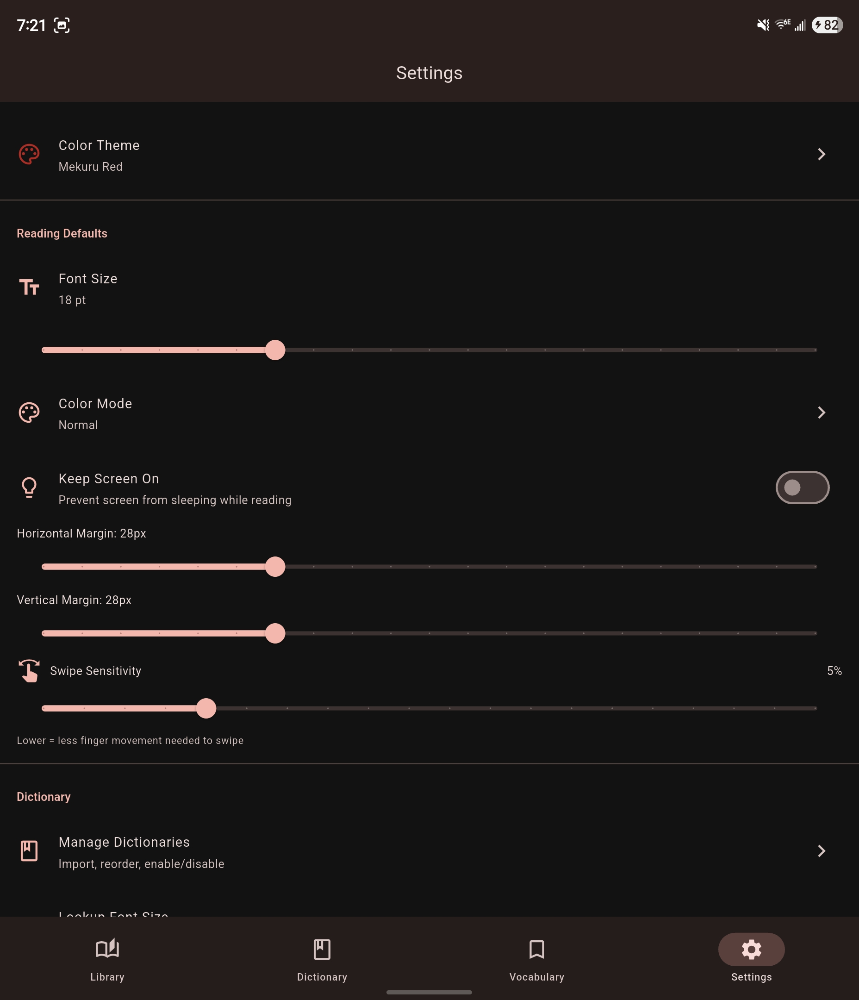

# Display Settings

Mekuru splits reader customization into two places: global defaults in **Settings**, and per-book quick settings inside the reader.

## Global Reading Defaults

The **Settings > Reading Defaults** section controls the defaults used across books:

| Setting | What it controls |
|-|-|
| **Font Size** | Default reader text size |
| **Color Mode** | Normal, Sepia, or Dark |
| **Sepia Intensity** | Warmth level when Sepia mode is active |
| **Keep Screen On** | Prevent the screen from sleeping while reading |
| **Horizontal Margin** | Side padding around EPUB text |
| **Vertical Margin** | Top and bottom padding around EPUB text |
| **Swipe Sensitivity** | How far you need to drag before a page swipe triggers |

## Per-Book Quick Settings

Inside an EPUB reader session, open the quick settings sheet for the current book to change:

| Setting | Notes |
|-|-|
| **Vertical Text** | Only available when the book supports it |
| **Reading Direction** | Switch between right-to-left and left-to-right for that book |
| **Disable Links** | Treat linked text as lookup targets instead of navigation |

These changes affect the current book view rather than the global app defaults.

## Manga Reader Settings

Image-based manga does not use the EPUB text layout controls above. Instead, the manga reader exposes its own settings such as view mode, reading direction, auto-crop, and transparent lookup. See [Reading Manga](manga/cbz-reading.md).
