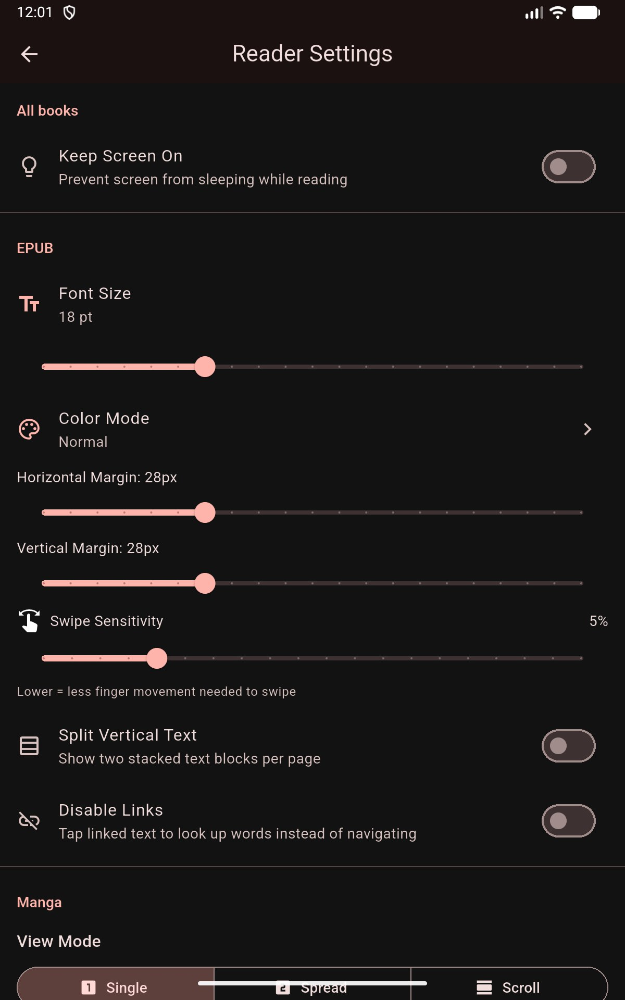

# Display Settings

Mekuru splits reader customization into two places: global defaults in **Settings > Reader Settings**, and per-book quick settings inside the reader.

## Global Reader Settings

Open **Settings** (gear icon on the **You** tab), then **Reader Settings**. The screen is grouped into **All books**, **EPUB**, and **Manga** sections:

| Setting | What it controls |
|-|-|
| **Font Size** | Default reader text size |
| **Color Mode** | Normal, Sepia, or Dark, with a sepia intensity control inside the picker |
| **Keep Screen On** | Prevent the screen from sleeping while reading |
| **Horizontal Margin** | Side padding around EPUB text |
| **Vertical Margin** | Top and bottom padding around EPUB text |
| **Swipe Sensitivity** | How far you need to drag before a page swipe triggers |
| **Split Vertical Text** | Show two stacked text blocks per page in vertical books |
| **Disable Links** | Treat linked text as lookup targets instead of navigation |
| **White Threshold** | Manga auto-crop tuning — lower values ignore more near-white artifacts |
| **Custom OCR Server** | Remote OCR endpoint for CBZ manga; see [Custom OCR Server](../manga/custom-server.md) |

## Per-Book Quick Settings

Inside an EPUB reader session, open the quick settings sheet for the current book to change:

| Setting | Notes |
|-|-|
| **Furigana** | Off, Book, All kanji, or JLPT — with a level picker for the JLPT mode; see [Furigana](furigana.md) |
| **Vertical Text** | Only available when the book supports it |
| **Reading Direction** | Switch between right-to-left and left-to-right for that book |
| **Disable Links** | Treat linked text as lookup targets instead of navigation |

These changes affect the current book view rather than the global app defaults.

## Manga Reader Settings

Image-based manga does not use the EPUB text layout controls above. Instead, the manga reader exposes its own settings such as view mode, reading direction, auto-crop, and transparent lookup. See [Reading Manga](../manga/cbz-reading.md).
