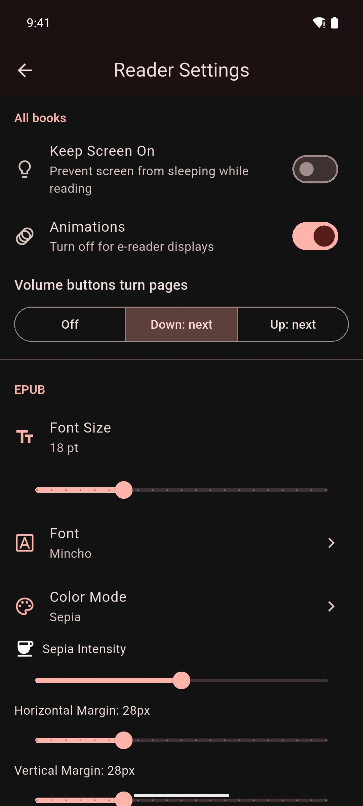

# Display Settings

Change how books look and behave in the EPUB reader: text size, font, colors, brightness, margins and more.

## Where the settings are

There are two places:

- **Quick Settings** is a sheet inside the reader with the settings you change most often. To open it, show the controls and tap **Settings** (gear icon).
- **Reader Settings** is the full list. To open it, tap **All settings** (sliders icon) at the top of Quick Settings, or go to **You › Settings › Reader Settings**.

## This book or all books

Three settings are saved separately for each book. You find them under **This book** in Quick Settings:

- **Vertical Text**
- **Reading Direction**
- **Furigana**

All other settings apply to every book. The JLPT level (from the Japanese-Language Proficiency Test) and the WaniKani stage that go with **Furigana** also apply to every book.

When you open a book for the first time, **Vertical Text** and **Reading Direction** follow the book's own layout.

## Quick Settings

### This book

- **Vertical Text** shows the book in tategaki (vertical writing: top to bottom, lines from right to left). Only Japanese, Chinese and Korean books can use it. For other books the switch is grayed out and says "Not available for this book's language".
- **Reading Direction** is **Right to Left** or **Left to Right**. It sets which way pages turn, which screen edge goes forward, and which way the seek bar runs.
- **Furigana** sets which kanji get small kana readings: **Off**, **Book**, **All kanji**, **JLPT** or **WaniKani**. See [Furigana](furigana.md).

If you switch a book away from its original layout, a note warns that some pages may not display correctly.

### Display

- **Font Size** goes from 12 to 48. The default is 18.
- **Font** opens a list: **Book default**, **Mincho**, **Gothic**, the fonts you added, and **Add font…**. **Book default** uses the book's own font. **Mincho** is a serif style, like most printed novels. **Gothic** is a sans-serif style. See [Fonts you add](#fonts-you-add).
- **Lookup Font Size** sets the text size in the lookup sheet, furigana included, from 12 to 32. The default is 16. The same setting is in **You › Settings**.
- **Brightness** sets the screen brightness while a book is open. Tap **Follow system brightness** (the icon at the right end of the slider) to use your phone's brightness again. When you leave the book, your phone's own brightness comes back.
- The color row has **Normal**, **Sepia** and **Dark**. With **Sepia**, a slider below sets how warm the page looks.

### Behavior

- **Scroll View**: "Slide through each chapter instead of turning pages". See [Navigation & Gestures](navigation.md).
- **Split Vertical Text**: "Show two stacked text blocks per page". It works only with **Vertical Text** on and **Scroll View** off.
- **Disable Links**: "Tap linked text to look up words instead of navigating". Linked text still shows in blue.

## Fonts you add

You can read EPUB books in a font of your own. It changes the book text only, not the lookup sheet, manga or the rest of the app.

1. Open **Font** in Quick Settings or Reader Settings.
2. Tap **Add font…** and pick the font file.

Mekuru takes **.ttf**, **.otf**, **.woff** and **.woff2** files up to 29.99 MB. Font collections (**.ttc**) don't work: pick a single **.ttf** or **.otf** font instead. The font shows in the list under its file name.

Mekuru keeps its own copy of the font, so you can move or delete the file you picked. To remove a font from Mekuru, tap the trash icon next to it and confirm. If you were using that font, the book goes back to **Book default**.

A [full backup](../settings/backup-restore.md) includes the fonts you added. A reading data backup only remembers which font you chose.

## Reader Settings

The screen has three sections: **All books**, **EPUB** and **Manga**. Brightness is not on this screen. Set it inside the reader.

### All books

- **Keep Screen On** stops the screen from sleeping while you read. It is off by default.
- **Animations** controls the lookup sheet sliding in, and page turns in the manga reader. Turn it off on an e-ink (e-paper) screen, where moving images leave ghost marks.
- **Volume buttons turn pages** has **Off**, **Down: next** (the default) and **Up: next**.

!!! note "Android only"
    **Volume buttons turn pages** is not available on iPhone and iPad.

### EPUB

This section has the same **Display** and **Behavior** settings as Quick Settings, except brightness and **Lookup Font Size** (which is in **You › Settings**). It also has these:

- **Sepia Intensity** shows when **Color Mode** is **Sepia**.
- **Horizontal Margin** and **Vertical Margin** set the space around the text, from 0 to 100 px. The default is 28 px.
- **Swipe Sensitivity** sets how far you drag before a swipe turns the page, from 1% to 20% of the screen. The default is 5%. Lower means less finger movement.

### Manga

This section sets the defaults for the manga reader: **View Mode**, **Reading Direction**, **Page Turn Edge Zone** and **Transparent Lookup**. With Pro you also see **White Threshold** (for [Auto-Crop](../manga/cbz-reading.md#trim-empty-margins-with-auto-crop-pro)) and **Custom OCR Server**.

**Page Turn Edge Zone** sets how much of each screen edge turns pages in the manga reader, from 5% to 25%. The default is 15%. It does not change the EPUB reader, where the outer quarter of each side turns pages.

See [Reading Manga](../manga/cbz-reading.md) and [Custom OCR Server](../manga/custom-server.md).

## If something goes wrong

- **Vertical Text is grayed out.** The book's language is not Japanese, Chinese or Korean.
- **Split Vertical Text is grayed out.** Turn off **Scroll View**. In Quick Settings, also turn on **Vertical Text**.
- **"This book was not originally formatted for vertical text. Some display issues may occur."** Turn **Vertical Text** off again if the pages look wrong. The opposite note appears when you turn a vertical book horizontal.
- **"Couldn't load this font; showing the book's own font."** The font you chose is damaged, or its file is no longer in Mekuru (for example after restoring a reading data backup on another phone). Add the font again or pick another one.
- **"This font is too large (over 29.99 MB)."** The reader can't use fonts this big. Many fonts come in smaller versions, for example one weight instead of all of them.
- **"This file isn't a font."** Pick a **.ttf**, **.otf**, **.woff** or **.woff2** file.

## Related pages

- [Navigation & Gestures](navigation.md)
- [Furigana](furigana.md)
- [Reading Manga](../manga/cbz-reading.md)
- [App Settings](../settings/app-settings.md)
