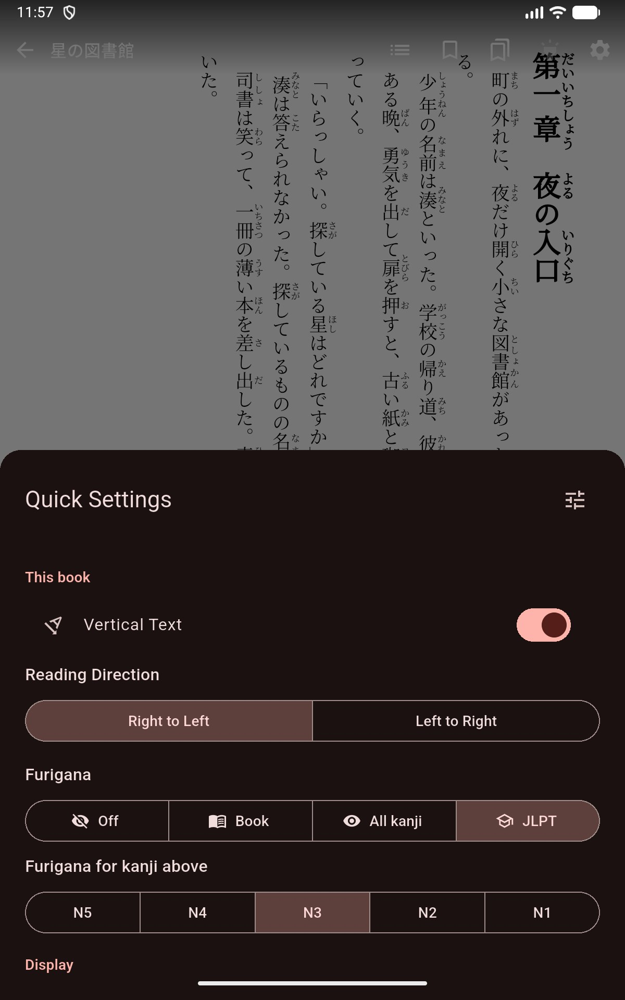

# Furigana

Mekuru can show furigana (ruby readings) above kanji while you read an EPUB, with a per-book setting that ranges from no furigana at all to readings on every kanji — including a JLPT mode that only annotates kanji above your study level.

## Furigana Modes

Open the quick settings sheet inside the reader and pick a **Furigana** mode for the current book:

| Mode | What it shows |
|-|-|
| **Off** | No furigana, including ruby text the publisher included |
| **Book** | Exactly the ruby text the publisher included, unchanged |
| **All kanji** | Generated furigana on every kanji word |
| **JLPT** | Furigana only on kanji above the JLPT level you pick |

When **JLPT** is selected, a **Furigana for kanji above** picker appears with levels N5 through N1. Choose N3, for example, and only kanji beyond the N3 kanji lists get readings.

## Publisher Ruby Follows the Same Rule

In **JLPT** mode the level filter also applies to furigana that was already in the book: publisher-authored ruby on kanji at or below your level is hidden, so books with full ruby stay readable as you progress.

## Accuracy

Generated readings come from Mekuru's built-in analyzer. Installing the optional [Enhanced Furigana Dictionary](../getting-started/downloadable-data.md#furigana-word-analysis) improves reading accuracy — it does not turn furigana on or off.

## Exporting

The same furigana engine can bake readings into a standalone EPUB file for use in other readers. See [Furigana EPUB Export](../library/furigana-export.md).
