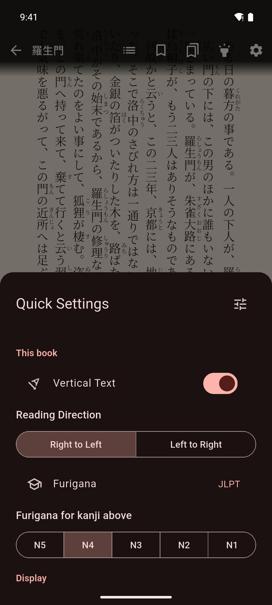

# Furigana

Choose which kanji show furigana (small kana above kanji that show how to read them) while you read an EPUB book.

## Before you start

- Furigana settings work in EPUB books. The manga reader does not add furigana.
- For **WaniKani** mode you need a WaniKani account.

## Pick a furigana mode

1. While reading, tap an empty spot in the middle of the page to show the controls.
2. Tap **Settings** (gear icon).
3. Under **This book**, tap **Furigana**.
4. Pick a mode.

Mekuru remembers the mode for each book.

| Mode | What you see |
|-|-|
| **Off** | No furigana at all, not even the furigana printed in the book |
| **Book** | Only the furigana that came with the book. This is the default. |
| **All kanji** | The book's furigana, plus furigana that Mekuru adds to every other word with kanji |
| **JLPT** | Furigana only on words with kanji above the JLPT level you pick |
| **WaniKani** | Furigana only on words with kanji you have not learned on WaniKani yet |

## Use JLPT mode

The JLPT (Japanese-Language Proficiency Test) has five levels, from N5 (easiest) to N1 (hardest).

1. Pick **JLPT** as the furigana mode.
2. Under **Furigana for kanji above**, tap the level you know: **N5**, **N4**, **N3**, **N2** or **N1**. The default is **N3**.

Words made only of kanji at your level or easier show no furigana. If a word has even one harder kanji, the whole word keeps its furigana. Kanji that are not on any JLPT list always get furigana.

The level you pick applies to all books.

## Use WaniKani mode

### Connect your WaniKani account

1. Go to **You › Settings › WaniKani**. In the reader you can also pick **WaniKani** and tap **Link your WaniKani account**.
2. Tap **Get an API token**. The WaniKani website opens.
3. Create a token there. A read-only token is enough.
4. Copy the token and go back to Mekuru.
5. Paste it into **API token**.
6. Tap **Link account**.

Mekuru downloads the SRS stage of every kanji you have studied. (SRS stages are WaniKani's learning stages, from Apprentice to Burned.) The screen then shows your level, how many kanji were synced and when.

Mekuru updates the list when you open the app, at most once an hour. To update it now, tap **Sync now**.

### Choose which kanji count as known

1. In the reader, pick **WaniKani** as the furigana mode.
2. Tap **Hide furigana at**.
3. Pick **Apprentice and up**, **Guru and up**, **Master and up**, **Enlightened and up** or **Burned**. The default is **Burned**.

A word keeps its furigana if any of its kanji is below that stage or is not in your WaniKani list yet. This choice applies to all books.

### Disconnect WaniKani

On the **WaniKani** screen, tap **Unlink**. Mekuru forgets the token and the kanji list.

## Furigana that the book already has

In **JLPT** and **WaniKani** modes, the same rule applies to the furigana printed in the book. The book's furigana on words you know is hidden. Pick **Book** to see all of it again.

## Get more accurate readings

Mekuru works out the readings with its built-in word analyzer. For better readings, install the **Enhanced Furigana Dictionary** from **You › Settings › Downloads**. It is a 45 MB download and takes about 250 MB on your device.

It also helps Mekuru find the right word when you tap. It does not turn furigana on or off. See [Install the Enhanced Furigana Dictionary](../getting-started/dictionaries.md#install-the-enhanced-furigana-dictionary-optional).

## Export a book with furigana

You can make a copy of a book with furigana built in, to read in other apps. See [Furigana EPUB Export](../library/furigana-export.md).

## If something goes wrong

- **"WaniKani rejected this token. Create a new one and try again."** Make a new token on the WaniKani website and paste it again.
- **"Couldn't reach WaniKani. Check your connection."** Check that you are online, then tap **Sync now**.
- **"WaniKani is rate limiting requests. Try again in a minute."** Wait a minute, then tap **Sync now**.
- **"Kanji list restored from a backup. Link again to keep it updated."** A backup brings back the kanji list but not the token. Paste your token again.
- **Tapping words stops working after you install the Enhanced Furigana Dictionary.** In **You › Settings › Downloads**, turn off **Use enhanced dictionary** and restart Mekuru. The download is kept, so you can turn it on again later.

## Related pages

- [Display Settings](display-settings.md)
- [Furigana EPUB Export](../library/furigana-export.md)
- [Downloads](../getting-started/downloadable-data.md)
- [Backup & Restore](../settings/backup-restore.md)
