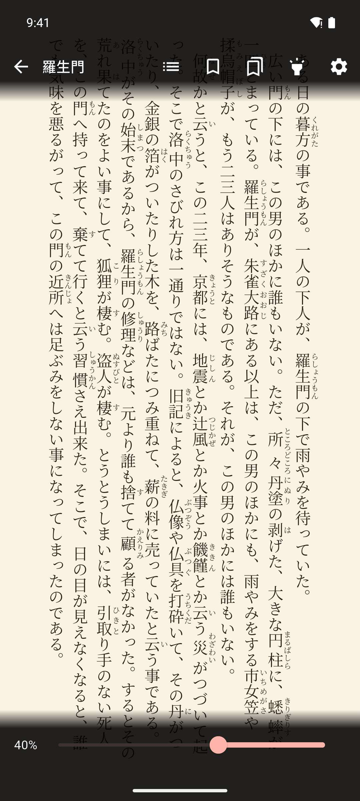

# Navigation & Gestures

Open a book, turn pages, and jump to any part of it in the EPUB reader.

## Before you start

You need a book in your library. See [Importing Books](../getting-started/importing-books.md) or get one from **You › Free books**.

## Open a book

1. Open the **Library** tab.
2. Tap the book's cover.

The book opens where you stopped reading. Mekuru saves your place as you read.

The **Continue reading** card at the top of the library shows the book you read last, with how far you are in it. Tap the card to go back to that book.

To open your last book every time Mekuru starts, go to **You › Settings › Startup Screen** and pick **Last Read Book**.

## Show or hide the controls

The reader opens with the controls hidden, so the page fills the screen. To show them:

- Tap an empty spot in the middle of the page, or above or below the text.
- Or swipe down. Swipe up to hide them again.

A tap on a word opens the lookup sheet instead. See [Looking Up Words](../dictionary/lookups.md).

The top bar has these buttons, from left to right:

- The back arrow closes the book.
- **Table of Contents** (list icon) shows the book's chapters.
- **Bookmark Page** (bookmark icon) saves this page.
- **View Bookmarks** shows your bookmarks.
- **Highlights** shows your highlights (Pro).
- **Settings** (gear icon) opens Quick Settings. See [Display Settings](display-settings.md).

## Turn pages

Which way is "next" depends on the book's reading direction. Most Japanese books read **Right to Left**, so the next page is on the left. You can change the direction for each book in [Display Settings](display-settings.md).

In the table, "swipe right" means moving your finger from left to right.

| To go to | In a **Right to Left** book | In a **Left to Right** book |
|-|-|-|
| Next page | Tap the left edge, swipe right, or press the Left arrow key | Tap the right edge, swipe left, or press the Right arrow key |
| Previous page | Tap the right edge, swipe left, or press the Right arrow key | Tap the left edge, swipe right, or press the Left arrow key |

- Taps: the outer quarter of the screen on each side turns pages. Tap an empty spot there. A tap on or close to text looks up a word instead, so on a full page it is easier to swipe.
- Swipes: you can swipe anywhere, also over text. To change how far you must drag, set **Swipe Sensitivity** in **You › Settings › Reader Settings**.

### Keyboard and page turners

These keys turn pages in any book:

- Space, Page Down or the Down arrow: next page.
- Shift+Space, Page Up or the Up arrow: previous page.

A Bluetooth page turner that sends these keys works the same way. Keys do nothing while a sheet, such as the lookup sheet, is open.

### Volume buttons

On Android, the volume buttons turn pages while a book is open. By default, volume down goes to the next page.

To change this:

1. Go to **You › Settings › Reader Settings**.
2. Under **Volume buttons turn pages**, pick **Off**, **Down: next** or **Up: next**.

The setting also applies to the manga reader.

!!! note "Android only"
    This feature is not available on iPhone and iPad.

## Jump to another part of the book

### Use the seek bar

1. Show the controls.
2. Drag the slider at the bottom. The percentage on the left shows where you are, and the page follows as you drag.
3. Let go to stay on that page.

In a **Right to Left** book, the slider runs from right to left.

### Use the table of contents

1. Show the controls.
2. Tap **Table of Contents** (list icon).
3. Tap a chapter.

If the book has no table of contents, the button does not appear.

### Use a bookmark

Tap **Bookmark Page** to save a page, and **View Bookmarks** to go back to it. See [Bookmarks & Highlights](bookmarks-highlights.md).

## Read in Scroll View

By default you turn pages. In **Scroll View**, each chapter is one long strip that you slide through.

To turn it on:

1. Show the controls and tap **Settings** (gear icon).
2. Under **Behavior**, turn on **Scroll View**.

**Scroll View** applies to all books. In Scroll View:

- Vertical text slides sideways. Horizontal text slides up and down.
- At the end of a chapter, swipe once more in the same direction to go to the next chapter.
- Edge taps do not turn pages. Tap an empty spot to show or hide the controls.
- Keys and volume buttons move one screen at a time.
- **Split Vertical Text** is not available.

## Use a screen reader

With TalkBack or VoiceOver, the page has **Next page** and **Previous page** actions. Double-tap the page to show or hide the controls.

## If something goes wrong

- **A tap opens the lookup sheet instead of turning the page.** You tapped on or near text. Swipe instead, or tap closer to the screen edge.
- **The volume buttons change the volume.** Check that **Volume buttons turn pages** is not set to **Off**. The buttons do not turn pages while a sheet is open.
- **"Reader took too long to load. Tap retry to try again."** Tap **Retry**. If the book still does not open, tap **Back** and try again later.

## Related pages

- [Display Settings](display-settings.md)
- [Bookmarks & Highlights](bookmarks-highlights.md)
- [Looking Up Words](../dictionary/lookups.md)
- [Reading Manga](../manga/cbz-reading.md)
