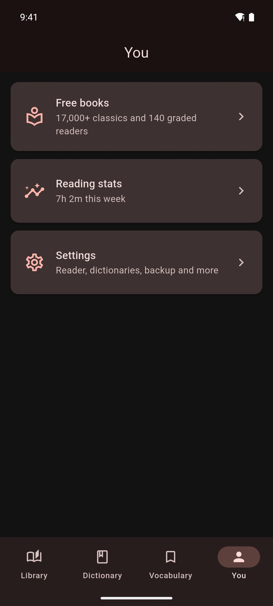

# App Settings

Change how Mekuru looks and works: language, theme, reader defaults, dictionaries, Anki, downloads, backups and Pro.

## Open Settings

1. Tap the **You** tab.
2. Tap **Settings**.

The **You** tab also has **Free books** and **Reading stats**. See [Free Books](../getting-started/free-books.md) and [Reading Stats](../stats/reading-stats.md).

The sections below follow the order of the **Settings** screen.

## General

- **App Language**: the language of Mekuru's menus. Choose **System default**, **English**, **Español**, **Bahasa Indonesia** or **简体中文**. Sentence translations in the lookup sheet use this language too. If your phone uses another language, Mekuru uses English.
- **Startup Screen**: what Mekuru shows when it starts: **Library**, **Dictionary** or **Last Read Book**.

## Appearance

- **Theme**: **Light**, **Dark** or **System default**.
- **Color Theme**: the app's accent color. **Mekuru Red** is the default. Others include **Indigo**, **Teal** and **Blue**.

## Reading

- **Reader Settings**: the settings for every book, in three sections: **All books**, **EPUB** and **Manga**. With Pro, the **Manga** section also has **Custom OCR Server**. See [Display Settings](../reading/display-settings.md#reader-settings).
- **WaniKani**: link your WaniKani account to hide furigana (small kana over kanji that show the reading) for kanji you have already learned. Once linked, the row shows **Linked as** and your user name. See [Furigana](../reading/furigana.md).

## Dictionary

- **Manage Dictionaries**: import, reorder, turn on or off, and delete dictionaries. See [Managing Dictionaries](../dictionary/management.md).
- **Lookup Font Size**: the text size in the lookup sheet.
- **Sentence translation**: what the **Sentence** tab of the lookup sheet does with its translation: **Show translation**, **Hide until tapped** or **Off**.
- **Translation model**: **Standard**, or **High quality**, a larger model (about 2.6 GB to download) that translates better on phones with plenty of memory.
- **Filter Roman Letter Entries**: hides entries whose headword is written in English letters.
- **Auto-Focus Search**: opens the keyboard when you switch to the **Dictionary** tab.

!!! note "Android only"
    **Translation model** and High quality translation are not available on iPhone and iPad. There, the **Sentence** tab always uses Apple's translation.

## Vocabulary & Export

- **AnkiDroid Integration** on Android, or **Anki Integration** on iPhone and iPad: choose how the words you send to Anki become cards. See [Exporting to Anki](../vocabulary/anki-export.md).

## Server sync

- **Book servers**: connect to your own Komga or Kavita server, browse and download its books, and keep your reading progress in sync. See [Book Servers](../library/book-servers.md).

## Pro

**Pro** opens the Mekuru Pro screen. Pro is a one-time purchase. It unlocks:

- **Auto-Crop**: trims empty margins from manga pages.
- **Book Highlights**: save and review highlighted passages in EPUB books.
- **On-device OCR**: reads the text in manga pages on your device, offline. OCR means reading the text in an image.
- **Custom OCR Server**: remote manga OCR with your own server.

To buy Pro, tap **Unlock Pro**. The button shows the price. You pay through Google Play on Android and through the App Store on iPhone and iPad. There is no Mekuru account and no sign-in.

When Pro is active, the screen says **You have Mekuru Pro**.

To get Pro back after you reinstall Mekuru or move to a new phone, open this screen and tap **Restore Purchase**. Mekuru asks the store for your purchase, so use the same Google or Apple account you bought it with. A purchase on Google Play does not unlock Pro on iPhone or iPad, or the other way round.

The OCR settings are in three places:

- the OCR models, in **Downloads**;
- **Custom OCR Server**, in **Reader Settings** (in the **Manga** section);
- **Test device speed**, on the Pro screen and in **Downloads** (Android only).

See [On-device OCR](../manga/on-device-ocr.md) and [Remote OCR (Pro)](../manga/cloud-ocr.md).

## Downloads

**Downloads** installs and removes extra data:

- **Dictionaries**: the starter pack (Jitendex and word frequency), **KANJIDIC** and **More Dictionaries**.
- **Assets**: **Kanji Stroke Order**, **Word Frequency** and the **Enhanced Furigana Dictionary**.
- **Japanese translation** and **High-quality translation (Gemma 4)**, the translation models. Android only.
- **Japanese manga OCR — manga-ocr**: the manga OCR model pack.
- **Scanned-book reader — NDLOCR-Lite**: the NDL text model for scanned free books and the PDFs you import.

See [Downloads](../getting-started/downloadable-data.md).

## Backup & Restore

**Backup & Restore** makes two kinds of backup: a small reading data backup (`.mekuru`) and a full backup (`.zip`) of your whole library. See [Backup & Restore](backup-restore.md).

## About & Feedback

- **Send Feedback**: send a bug report or an idea from inside the app. Only **Message** is required. **Name** and **Email** are optional.
- **Rate Mekuru**: opens Mekuru's page in Google Play or the App Store, where you can leave a review.
- **Documentation**: opens this guide.
- **About Mekuru**: the app version, the **Privacy Policy**, and **Attributions**, which lists data sources, licenses and credits.

## Related pages

- [Display Settings](../reading/display-settings.md)
- [Downloads](../getting-started/downloadable-data.md)
- [Backup & Restore](backup-restore.md)
- [On-device OCR](../manga/on-device-ocr.md)
