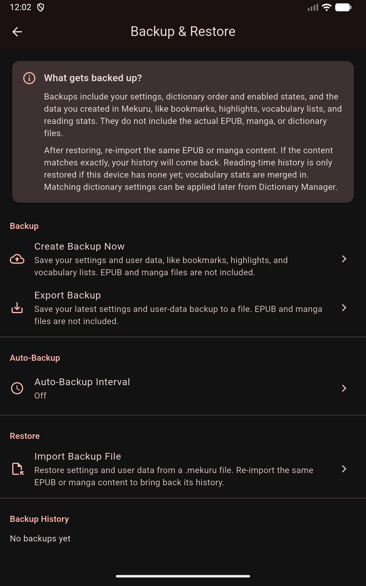

# Backup & Restore

Mekuru can save your settings and reading data to a single local backup file and restore it later — on the same device, a new phone, or a side-by-side install such as the parallel test build.

## Creating a Backup

1. Open **Settings** from the gear icon on the **You** tab.
2. Open **Backup & Restore**.
3. Tap **Create Backup Now**, then **Export Backup** to save the latest backup as a `.mekuru` file wherever you like.

An **Auto-Backup Interval** option can also create backups on a schedule instead of manually.

## What a Backup Contains

- App settings and reader defaults, including per-book reader settings such as the furigana mode
- Dictionary order and enabled states
- Bookmarks and highlights
- Vocabulary lists and their stats
- Collections, including each collection's book order
- Reading-time history

A backup does **not** contain the actual EPUB, manga, or dictionary files — those stay where you imported them from.

## Restoring

Use **Import Backup File** and pick a `.mekuru` file. Restoring overwrites your current settings. Books restore as entries that wait for their content: re-import the same EPUB or manga file and its bookmarks, highlights, progress, and settings reattach automatically.

Two merge rules to know:

- **Reading-time history** is only restored onto a device that has no history of its own.
- **Vocabulary stats** are merged rather than overwritten.
