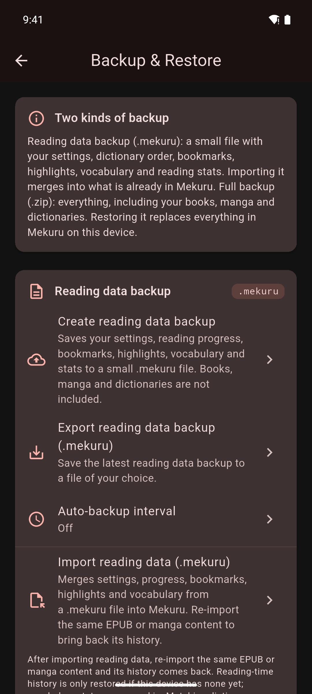

# Backup & Restore

Keep a copy of your reading data, or move your whole library to a new phone.

To open it, go to **You › Settings › Backup & Restore**.

## Which backup to use

Mekuru has two kinds of backup. Each has its own card on the screen and its own file type.

| | Reading data backup | Full backup |
|-|-|-|
| File | a small `.mekuru` file | a large `.zip` file, often several gigabytes |
| Contains | your settings and reading data | everything: books, manga, dictionaries, settings and reading data |
| Restoring | merges into what is already in Mekuru | replaces everything in Mekuru on this device |
| Automatic | yes, daily or weekly if you turn it on | no, you start it yourself |

Use the reading data backup as a frequent safety net. Use the full backup to move to a new phone, or before you reset one.

## Reading data backup (.mekuru)

A reading data backup contains:

- your app and reader settings;
- reading progress, and each book's own settings;
- bookmarks and highlights;
- your vocabulary;
- collections;
- reading stats;
- the order of your dictionaries, and which ones are turned on;
- your book server connections (names and addresses, never keys or passwords).

It does not contain your EPUB, manga or dictionary files.

### Make a reading data backup

1. Tap **Create reading data backup**. It appears under **Reading data backup history**.
2. To keep a copy outside Mekuru, tap **Export reading data backup (.mekuru)** and choose where to save it. Mekuru exports the latest backup.

Backups in the history are deleted if you uninstall Mekuru. Export one from time to time.

### Back up automatically

1. Tap **Auto-backup interval**.
2. Choose **Daily** or **Weekly**. Choose **Off** to stop.

Mekuru makes the backup when you open the app and one is due. It keeps the last five automatic backups.

### Restore reading data

1. Tap **Import reading data (.mekuru)** and pick the file. To use a backup from the history instead, tap the menu next to it, then tap **Restore**.
2. Mekuru asks **Import reading data?**. To bring back your dictionary order too, tick **Queue dictionary settings from this backup**.
3. Tap **Restore**.
4. If some books already have reading data on this device, Mekuru lists them under **Conflicting Books**. Select the ones the backup should overwrite and tap **Overwrite**, or tap **Skip All** to keep what is on this device.

What happens to your data:

- The settings in the backup replace your current settings.
- Everything else merges with what is already in Mekuru.
- Books come back as entries that wait for their files. Import the same EPUB or manga again, and its progress, bookmarks and highlights come back.
- Reading-time history is only restored if this device has none yet. Vocabulary stats are merged.
- Book server connections that are not on this device yet come back turned off. Enter their keys or passwords again to use them.
- To apply the dictionary order you queued, first install the same dictionaries. Then open **You › Settings › Manage Dictionaries** and tap **Apply Backup Settings**.

## Full backup (.zip)

A full backup is one file with everything in Mekuru: your books, manga, dictionaries, settings and reading data. It also holds custom covers, and the **Enhanced Furigana Dictionary** if you downloaded it.

Not included:

- the **Kanji Stroke Order** data;
- the reading data backup history;
- the manga OCR model pack, the NDL text model and the translation models from **You › Settings › Downloads**.

Download them again after you restore.

While a full backup or restore runs, Mekuru shows a full-screen page with its progress, and you cannot use the rest of the app. To stop, tap **Cancel**, then **Stop**. A stopped backup leaves no file behind. A stopped restore changes nothing.

The steps differ on Android and on iPhone and iPad. See the sections below.

### On Android

**Make a full backup**

1. Tap **Export full backup (.zip)…**.
2. Mekuru may ask to show notifications. The backup runs either way. Notifications only let you follow it from outside the app.
3. Choose a folder: your phone's storage, an SD card, or a cloud folder that can save files.
4. Wait on the **Backing up** page, or leave Mekuru and come back later. The backup keeps running in the background, and a notification shows its progress.
5. Tap **Done** when it finishes.

If Mekuru is closed or the phone restarts during a backup or restore, it continues where it stopped the next time you open Mekuru.

The file is named `mekuru-full-backup-<date>-<time>.zip`. While it is being written, its name ends in `.partial`, so a half-finished file is never mistaken for a backup.

Manga that you linked from a folder outside Mekuru are copied from that folder into the backup. If Mekuru can no longer read the folder (for example, the SD card was removed), that manga is saved without its pages.

**Restore a full backup**

Follow the steps in [Restore a full backup](#restore-a-full-backup). At the end:

1. Tap **Close Mekuru**. Mekuru closes to put your restored data in place.
2. Open Mekuru again.

If you left the app during the restore, a notification tells you when it is ready. Open Mekuru to finish.

### On iPhone and iPad

**Make a full backup**

1. Tap **Export full backup (.zip)…**.
2. Keep Mekuru open on screen until the backup finishes. The screen stays on while it runs. If Mekuru closes, nothing resumes: start the backup again.
3. When the backup is ready, the Files picker opens. Choose where to save it, for example in On My iPhone or iCloud Drive. If you close the picker without saving, tap **Save backup…** to choose again.
4. Tap **Done**. A backup you did not save is deleted.

Mekuru writes the backup inside the app before you save it, so your device needs free space about the size of your library.

**Restore a full backup**

Follow the steps in [Restore a full backup](#restore-a-full-backup). Keep Mekuru open until the files are copied. At the end, tap **Reload Mekuru**. Mekuru reloads and opens your restored library.

Mekuru first copies the backup file you pick into the app, so you need free space for the file and for its contents.

### Restore a full backup

Restoring a full backup replaces everything in Mekuru on this device: books, manga, dictionaries, settings and reading data. Nothing outside Mekuru is touched.

1. Tap **Restore full backup (.zip)…** and pick the file.
2. **Review full backup** shows what is in the file (**In this file**) and what is in Mekuru now (**In Mekuru on this device now**). Tap **Continue**.
3. Read the warning **Delete Mekuru's data and replace it?**.
4. Tick **I understand that Mekuru's data on this device will be deleted**, then tap **Delete Mekuru data and replace**. The button stays off until you tick the box.
5. The **Restoring** page shows the files being copied. You can still cancel here: nothing in Mekuru has changed yet.
6. Finish the restore as described for your device: tap **Close Mekuru** on Android, or **Reload Mekuru** on iPhone and iPad.

Your restored library then opens with the message "Full restore complete".

If something goes wrong before the last step, nothing on your device changes and Mekuru tells you why. If the restore cannot be completed after that, your previous data is kept and a message says so.

### After a full restore

- Book servers (Komga and Kavita) come back turned off. Enter their keys or passwords again to turn them on.
- A linked WaniKani account comes back without its API token. Open **You › Settings › WaniKani** and link it again.
- Pro is not part of the backup. Mekuru asks the store for your purchase after the restore. If Pro is still locked, open **You › Settings › Pro** and tap **Restore Purchase**.
- The key of a custom OCR server is not part of the backup. Enter it again in **You › Settings › Reader Settings › Custom OCR Server**.
- Manga that were linked from a folder outside Mekuru come back as ordinary manga stored inside Mekuru. You no longer need the old folder.

### What is inside the file

You can open a full backup on a computer and copy single books out of it. Do not rename, move or edit files inside it if you plan to restore from it.

| Folder or file | What is in it |
|-|-|
| `Books/<title>/` | one folder per EPUB, with the original `.epub` file |
| `Manga/<title>/` | one folder per manga, with its page images |
| `Mekuru data/` | Mekuru's own files: the database (dictionaries, progress, vocabulary, stats, collections), the settings, custom covers and the Enhanced Furigana Dictionary |
| `README.txt` | a short description of the layout and how to restore |
| `manifest.json` | a summary that Mekuru checks before it restores |

## If something goes wrong

- **"This full backup was made with Mekuru …"** The backup comes from a newer version of Mekuru. Update Mekuru, then try again.
- **"Not enough free space on this device."** The message says how much more space is needed. Free some space, then try again.
- **"A book import is still running."** Wait for the import to finish, then try again.
- **"This file is incomplete or damaged."** The file was cut short while it was copied or downloaded. Copy it again from where you saved it.
- **You picked the wrong kind of file.** Mekuru tells you which button to use instead. A `.mekuru` file goes in **Import reading data (.mekuru)**, and a full backup goes in **Restore full backup (.zip)…**.
- **"The file was saved with a temporary name ending in .partial."** Rename the file so that it ends in `.zip` before you restore from it.

## Related pages

- [App Settings](app-settings.md)
- [Managing Dictionaries](../dictionary/management.md)
- [Book Servers](../library/book-servers.md)
