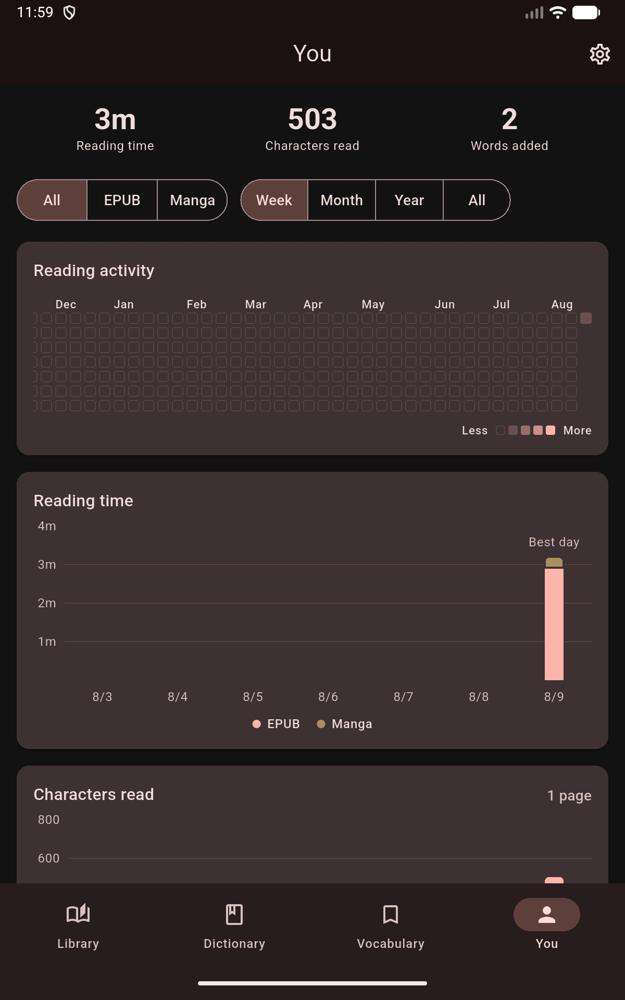

# Reading Stats

The **You** tab tracks your Japanese reading over time — how long you read, how often you look words up, and how your saved vocabulary grows — all computed on-device from your actual reading sessions.

## What You'll See

- **Headline numbers** - reading time, characters read, and words added for the selected period
- **Reading activity** - a calendar-style heatmap of daily reading
- **Reading time** - a per-day chart split between EPUB and manga, with your best day marked
- **Characters read** - volume over time, with a page-count estimate
- **Lookup rate** - lookups per 1,000 characters, a rough proxy for how comfortable a book is
- **Vocabulary growth** - how your saved-word count develops over time

Filters at the top switch between all content, EPUB, or manga, and between week, month, year, or all time.

## Where Settings Went

The Settings screen is reached from the gear icon in the **You** tab's app bar. See [App Settings](../settings/app-settings.md).

## Privacy and Backup

Stats are stored locally on your device and are never uploaded. Reading-time history is carried through [Backup & Restore](../settings/backup-restore.md) — it is restored onto a device that has no history of its own, and vocabulary stats are merged.
