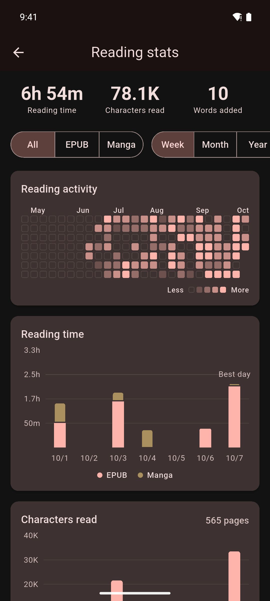

# Reading Stats

See how much Japanese you read, how often you look words up, and how your vocabulary grows.

Open **You › Reading stats**. The **Reading stats** card on the **You** tab also shows your reading time for the last 7 days.

## Choose what to show

Below the three totals at the top are two rows of buttons:

- **All**, **EPUB** or **Manga**: which books count.
- **Week**, **Month**, **Year** or **All**: the time window. **Week** is the last 7 days, **Month** the last 30 days, **Year** the last 12 months, and **All** everything since your first reading session.

The totals and the charts follow both choices. The **Reading activity** card is the exception: it always shows the last 12 months.

## The totals

- **Reading time**: how long you had books open in the reader.
- **Characters read**: how many characters were on the pages you read.
- **Words added**: new words you saved to your vocabulary or sent to Anki. Each word counts once, on the day you first added it.

## The cards

### Reading activity

One square for each day of the last 12 months. The darker the square, the longer you read that day. Tap a square to see that day's **Reading time**, **Characters read** and **Lookups**.

### Reading time

A bar for each day (**Week**, **Month**) or each month (**Year**, **All**). With **All** books selected, EPUB and manga have their own colors. **Best day** marks your longest reading day ever, when it falls inside the window.

### Characters read

Characters read for each day or month. The top of the card shows how many pages you turned in the window.

### Lookup rate

**Lookups per 1,000 characters**: how many words you looked up for every 1,000 characters you read. A falling line usually means the text is getting easier for you. Days without reading leave gaps in the line.

### Vocabulary growth

The running total of different words you have added, by saving them or sending them to Anki.

## How reading is counted

- A reading session starts when you open a book. It ends when you close the book, switch to another app, or lock the screen. When you come back, a new session starts.
- A page's characters count once the page has stayed on screen for 3 seconds. Pages you flip past or skip with the seek bar do not count.
- In the EPUB reader's **Scroll View**, new text counts as it comes onto the screen.
- In manga, characters come from the page's OCR text (the text read from the page image). A page without OCR text adds reading time but no characters.
- **Lookups** are the words you look up while reading.
- A word you save outside a book, for example from the **Dictionary** tab, counts under **All** but not under **EPUB** or **Manga**.

## Privacy and backups

Your reading stats are stored on your device. Mekuru's anonymous usage statistics never include book titles, page text or the words you look up; see the [privacy policy](https://mekuru.matthew.moe/privacy.html).

Backups carry your stats to another device:

- A full backup restores all of them.
- A reading data backup restores your reading history only on a device that has none of its own. Your word history is merged with the device's.

See [Backup & Restore](../settings/backup-restore.md).

## Related pages

- [Saving & Managing Words](../vocabulary/saving-words.md)
- [Exporting to Anki](../vocabulary/anki-export.md)
- [Backup & Restore](../settings/backup-restore.md)
