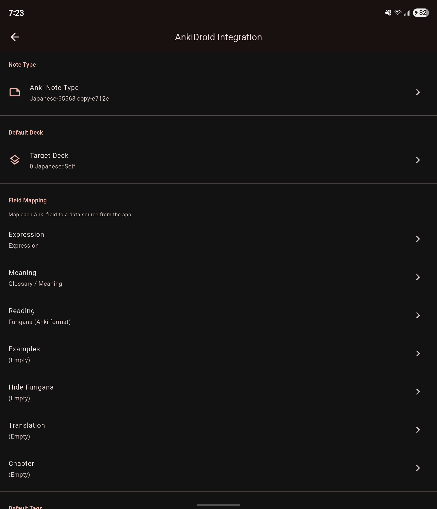

# Exporting to Anki

Mekuru supports two ways to move saved vocabulary into Anki.

## CSV Export

Export your saved words as an Anki-friendly CSV file. The export includes:

| Column | Content |
|-|-|
| Word | Saved expression |
| Reading | Saved reading |
| Meaning | Joined dictionary definitions |
| Furigana | Anki-formatted furigana markup generated from the saved word and reading |
| Context | The saved sentence context |

To export:

1. Open the **Vocabulary** tab.
2. Tap the **Export CSV** icon to enter selection mode.
3. Select the entries you want, or use **Select all**.
4. Tap the export icon again to export the selected entries.
5. Choose a save location in the file-save dialog.

The generated CSV can be imported into Anki on desktop or mobile.

## AnkiDroid Direct Integration

> **Android only** - This feature requires the [AnkiDroid](https://play.google.com/store/apps/details?id=com.ichi2.anki) app.

Mekuru can send cards directly to AnkiDroid from dictionary lookup cards.

### Setup

1. Go to **Settings > AnkiDroid Integration**.
2. Select the target deck.
3. Select the note type.
4. Map Mekuru's fields to the note type's fields.
5. Optionally set tags to apply to created cards.

### Sending Cards

Once configured, a **Send to AnkiDroid** button appears on dictionary lookup cards. Mekuru first checks whether the word is already in your default deck: if it is, the button shows a check mark (**Already in default Anki deck. Long press to add anyway**). Otherwise tapping it opens a card screen where you can change the **Deck** and **Tags** before pressing **Add to Anki**. If AnkiDroid is not set up yet, the button opens the settings screen instead.

### When Anki Changes

AnkiDroid stays the source of truth. If you delete or rename the note type, deck, or a mapped field in Anki, Mekuru flags it: the settings rows read **no longer exists in Anki**, orphaned field mappings are listed with a **Remove** button and can be moved to another field, and the card screen shows a warning until the mapping is fixed. Send errors say whether AnkiDroid was unreachable, its permission was missing, or the note type or deck is gone.
