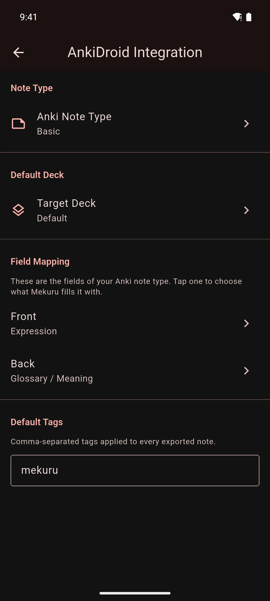
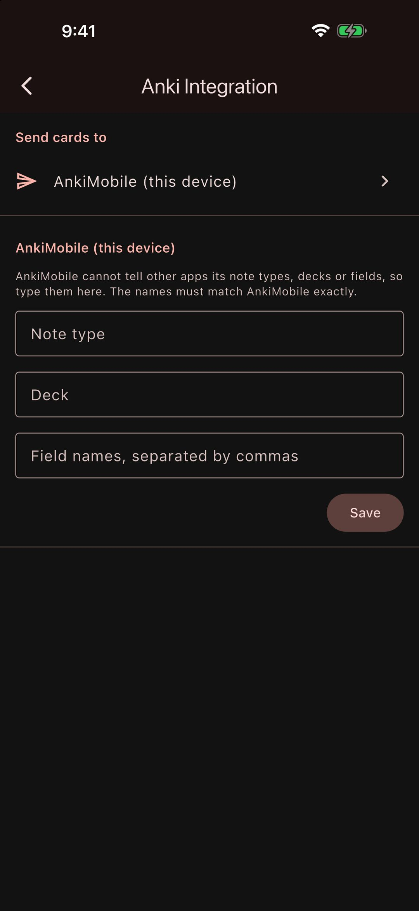

# Exporting to Anki

Send a word from the lookup sheet straight to Anki as a flashcard, filled with the word, its reading, definitions, the sentence and more.

On Android, Mekuru sends cards to the AnkiDroid app. On iPhone and iPad, it sends them to the AnkiMobile app or to Anki on a computer. Set up the one you use below, then send cards the same way on both.

## What a card can contain

Each field of your Anki note type gets one of these sources. You choose them in the **Field Mapping** settings.

| Source | What goes in the field |
|-|-|
| **Expression** | The word as written |
| **Reading** | Its reading in kana |
| **Furigana (Anki format)** | The word with its reading in Anki's furigana format, for example `食[た]べる` |
| **Glossary / Meaning** | The definitions |
| **Sentence Context** | The sentence you found the word in |
| **Sentence Translation** | That sentence translated into the app's language |
| **Frequency Rank** | How common the word is, from your frequency dictionary |
| **Dictionary Name** | The dictionary the definitions come from |
| **Pitch Accent** | The word's pitch accent (its pattern of high and low pitch), as the reading and the position of the pitch drop, for example `はし [1]` |
| **(Empty)** | Nothing |

Notes on the sources:

- **Sentence Translation** is filled only when sentence translation is already installed on your device. Otherwise the field stays empty. The translation is in the app's language: English, Spanish, Indonesian or Simplified Chinese. See [Sentence Translation](../dictionary/sentence-translation.md).
- **Frequency Rank** needs a frequency dictionary, such as the JPDB word frequency in the starter pack. **Pitch Accent** needs a pitch accent dictionary.
- The card also gets your default tags. The default tag is `mekuru`.

## Set up and send cards

### On Android

You need the [AnkiDroid](https://play.google.com/store/apps/details?id=com.ichi2.anki) app.

#### Set up AnkiDroid

1. Go to **You › Settings › AnkiDroid Integration**. It is in the **Vocabulary & Export** section.
2. When Android asks, allow Mekuru to use AnkiDroid.
3. Under **Note Type**, tap **Anki Note Type** and choose a note type.
4. Under **Default Deck**, tap **Target Deck** and choose a deck.
5. Under **Field Mapping**, tap each field and choose a source for it. Each source shows a preview of what it would put in the field. The preview uses the example word 食べる, or the word you looked up if you came from the lookup sheet.
6. Optional: under **Default Tags**, enter tags separated by commas.

#### Send a card

1. In the reader, tap a word.
2. In the lookup sheet, tap **Send to AnkiDroid** (the lightning icon) next to the word.
3. Check the card. You can change the **Deck**, edit any field, and change the **Tags**.
4. Tap **Add to Anki**.

If you have not set up AnkiDroid yet, step 2 opens the settings, with your word in the previews.

#### Duplicates

Mekuru checks your default deck for a card whose first field matches. If it finds one, the button shows a check mark: **Already in default Anki deck. Long press to add anyway**. Press and hold the button to add another card. On the card screen, a note warns you when the deck you chose already has the word.

#### When you change things in AnkiDroid

If you delete or rename the note type, the deck or a mapped field in AnkiDroid, **AnkiDroid Integration** marks it as no longer existing. A mapped field that is gone stays in the list. Tap it to move its source to another field, or tap **Remove** (the trash icon) to drop it. The card screen shows a warning until you fix the mapping.

#### If something goes wrong

- **AnkiDroid permission not granted. Make sure AnkiDroid is installed and try again.**: install AnkiDroid, tap **Retry**, and allow access.
- **Could not connect to AnkiDroid. Make sure AnkiDroid is installed and running.**: open AnkiDroid once, then tap **Retry**.
- **Failed to add note. Make sure AnkiDroid is running and the selected note type and deck still exist.**: check the note type and deck in **AnkiDroid Integration**.

### On iPhone and iPad

Go to **You › Settings › Anki Integration**. Under **Send cards to**, choose where your cards go:

- **AnkiMobile (this device)**: the Anki app on your iPhone or iPad. This is the default.
- **Anki on a computer (AnkiConnect)**: Anki on a computer on the same network, through the AnkiConnect add-on.

To send a card, tap **Send to Anki** (the lightning icon) in the lookup sheet, check the card, and tap **Add to Anki**, as on Android.

#### AnkiMobile

AnkiMobile does not tell other apps its note types, decks or fields, so you type them in Mekuru.

1. In **Anki Integration**, keep **Send cards to** on **AnkiMobile (this device)**.
2. Enter the **Note type** and the **Deck**, exactly as they are named in AnkiMobile.
3. In **Field names, separated by commas**, enter the note type's fields, for example `Front, Back`.
4. Tap **Save**.
5. Under **Field Mapping**, tap each field and choose a source for it.

When you tap **Add to Anki**, AnkiMobile opens, adds the card and returns you to Mekuru.

Mekuru cannot check AnkiMobile for duplicates. AnkiMobile refuses a duplicate card itself, and it also refuses a card whose note type, deck or field name is misspelled. It shows its own message when it does. Mekuru cannot see that message, so if a card is missing, check AnkiMobile.

#### Anki on a computer (AnkiConnect)

You need Anki on a computer on the same network as your iPhone or iPad, with the AnkiConnect add-on.

1. In Anki on your computer, install the AnkiConnect add-on (code 2055492159).
2. In the add-on's config, set `"webBindAddress": "0.0.0.0"` so other devices can reach it. Restart Anki.
3. On your iPhone or iPad, in **Anki Integration**, set **Send cards to** to **Anki on a computer (AnkiConnect)**.
4. Under **AnkiConnect address**, enter the computer's address with port 8765, for example `http://192.168.1.20:8765`. Then tap **Connect** (the sync icon).
5. When iOS asks, allow Mekuru to find devices on your local network.
6. Choose the **Anki Note Type**, the **Target Deck** and the **Field Mapping**, as on Android.

Anki must be running on the computer when you send a card. Mekuru checks your default deck for duplicates, as on Android.

If you see **Could not connect to Anki. Check the address and make sure Anki is running on your computer.**, check the address, that Anki is open, and that both devices are on the same network.

## Export a CSV file instead

You can also export your saved words as a CSV file and import it into Anki. See [Export as CSV](saving-words.md#export-as-csv).

## Related pages

- [Saving & Managing Words](saving-words.md)
- [Looking Up Words](../dictionary/lookups.md)
- [Reading Stats](../stats/reading-stats.md): cards you send count toward **Words added** and **Vocabulary growth**.
