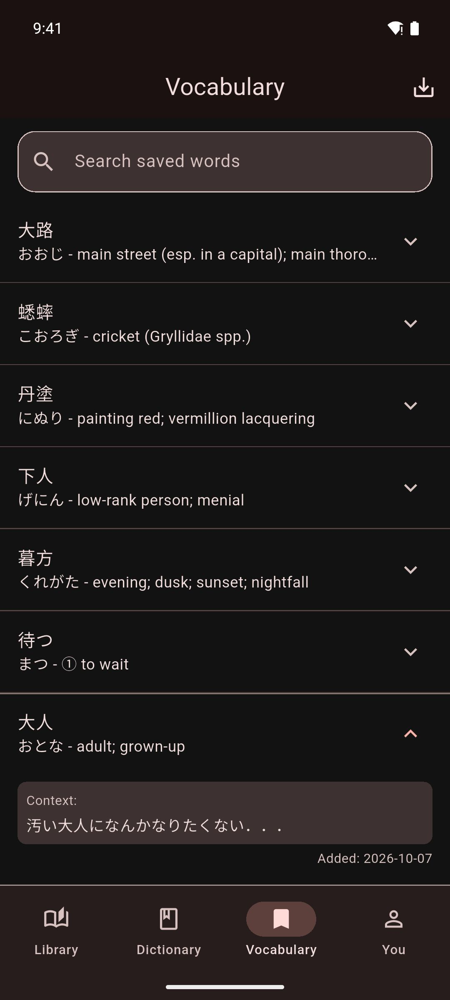

# Saving & Managing Words

Save the words you look up, together with the sentence you found them in, and review, search or export them in the **Vocabulary** tab.

## Save a word

1. In the reader, tap a word. The lookup sheet opens.
2. In the lookup sheet, tap **Save to Vocabulary** (the bookmark icon) next to the word.

Mekuru confirms that the word is saved, and the button turns into a check mark.

Mekuru saves:

- the word and its reading
- its definitions
- the sentence you found it in
- the date you saved it

In manga, the sentence comes from the page's OCR text (the text read from the page image). You can also save words from search results in the **Dictionary** tab; those have no sentence.

You can save each word and reading once. If it is already in your list, the button shows a check mark (**Already in vocab list**). Tapping it then shows **Word already exists in vocab list**.

### Fix the sentence before saving (manga)

OCR can misread a line. In the manga reader you can correct the sentence before you save:

1. In the lookup sheet, open the **Sentence** tab.
2. Tap **Edit sentence** and correct the text.
3. Go back to the **Dictionary** tab and tap **Save to Vocabulary**.

The corrected sentence is saved with the word.

## Review your words

Open the **Vocabulary** tab. Your newest words are at the top. Each entry shows the word, its reading and its first definition.

Tap an entry to expand it. You see:

- the other definitions
- the saved sentence, under **Context:**
- the date you saved it, after **Added:**

## Search your words

Type in **Search saved words** at the top of the **Vocabulary** tab. The list shows the words whose word, reading, definitions or saved sentence contain your search.

To see every word again, tap **Clear search** (the X in the search field).

## Delete a word

Swipe the entry from right to left. To bring it back, tap **Undo** in the message that appears.

## Export as CSV

A CSV file is a plain text table. Anki and spreadsheet apps can import it.

1. In the **Vocabulary** tab, tap **Export CSV** (the download icon at the top).
2. Tap the words you want, or tap **Select all**. After a search, **Select all** selects only the words you found.
3. Tap **Export selected**.
4. Choose a folder and save the file. Its name is `vocabulary_export_` followed by the date.

To leave selection mode, tap **Close** (the X).

!!! note "On iPhone and iPad"
    The Files picker opens for step 4. Choose a folder, for example in iCloud Drive or On My iPhone, and confirm.

The first row of the file names the columns:

| Column | Contains |
|-|-|
| Word | The saved word |
| Reading | Its reading in kana |
| Meaning | The definitions, separated by semicolons |
| Furigana | The word with its reading in Anki's furigana format, for example `食[た]べる` |
| Context | The saved sentence |

## Related pages

- [Looking Up Words](../dictionary/lookups.md)
- [Exporting to Anki](anki-export.md): send a word straight to Anki from the lookup sheet.
- [Reading Stats](../stats/reading-stats.md): saved words count toward **Words added** and **Vocabulary growth**.
- [Backup & Restore](../settings/backup-restore.md): backups include your saved words.
